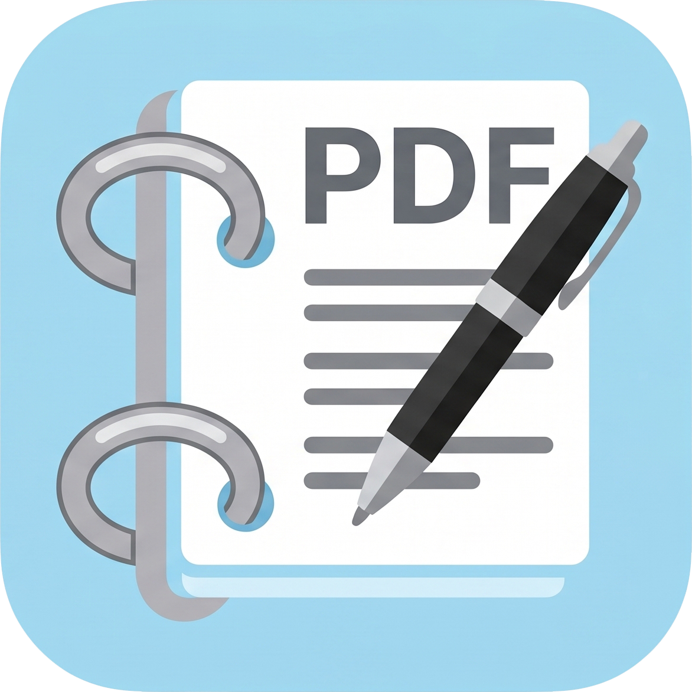

# PDF Binder

<div align="center">
  
  <h3>直感的で軽快なWindows向けPDFバインダー＆手書き編集ツール</h3>
</div>

---

## 📖 概要
**PDF Binder** は、直感的なタイル状グリッドでPDFページを自由に並び替え・回転・結合・分割・白紙追加できる「バインダー整理機能」と、ペン・蛍光ペン・直線・消しゴムによる「手書きアノテーション機能」を融合した、軽快なWindowsデスクトップアプリケーションです。

商用・非商用問わず誰でも安心して利用・再配布できるよう、寛容型オープンソースライセンス（MIT / Apache-2.0 / BSD）のコンポーネントのみで構築されています。

---

## ✨ 主な機能

### 1. 詳細ビュー（単一ページ／縦連続表示）
- **選べる2つの表示モード**:
  - **単一ページ表示（初期値）**: 1ページずつ集中して閲覧・手書き記入。ページが画面に収まっている時はマウスホイールで前後のページを素早くめくり、拡大表示中はページ内をスクロールして上下端に達した状態でスムーズに前後のページへ切り替え
  - **連続表示**: 全ページが縦一列に並ぶ連続ビュー。スクロール途中で拡大率が変わらない固定維持により、快適なスクロール閲覧を実現
- **外部PDFのドラッグ＆ドロップ**: エクスプローラーからPDFをドラッグ＆ドロップするだけで末尾に追加結合（未読み込み時は新規表示）。ドラッグ中は分かりやすい案内オーバーレイを表示
- **ズーム連動動的プレビュー**: 最大3200%までの超高倍率ズームに対応。高倍率に応じた適応型スナップ目盛りにより快適に拡大縮小でき、現在のズーム倍率に合わせてリアルタイム・デバウンス描画。縮小表示時も細線が消失せず文字がかすれず、拡大時もくっきり鮮明
- **手書きアノテーション**:
  - ペンツール（自由な色・太さでの滑らかなベクター手書き）
  - 蛍光ペンツール（下の文字が透けて見える半透明ハイライト描画）
  - 消しゴムツール（一筆消しの「ストローク消し」と、ピクセル消しの「部分消し」）
  - 直線トグル（ペン・蛍光ペンでまっすぐ直線を引けるトグルモード）
  - 太さ・色の状態保持（ツール切り替え時も直前の太さ・色を独立記憶）
- **パームリジェクション & タッチ操作**: ペン使用時は手首の誤動作を完全防止。指1本で画面移動（パン）、指2本で直感的なピンチズームに対応
- **高品位PDF合成**: 手書き内容は拡大や印刷でも劣化しないベクター＆透過合成で保存

### 2. 俯瞰グリッド（バインダー整理）
- **必要な時だけ切り替え**: 「表示」タブからいつでもワンクリックで切り替え。サムネイルはグリッド表示時に初めてオンデマンド生成されるため、大容量ファイルも待たずに開けます
- **ドラッグ＆ドロップ並び替え**: マウス操作で直感的にページ順序を変更
- **外部PDFの追加結合**: 外部PDFファイルをドラッグ＆ドロップして末尾に手軽に追加結合（ドロップ案内オーバーレイ対応）
- **スムーズ連携**: 任意のカードをダブルクリックすると詳細ビューへ切り替わり、該当ページへ自動スクロール
- **ページ操作**: 時計回り/反時計回りの回転、ページの削除、白紙ページの追加（隣接サイズ自動継承）
- **分割＆抽出**:
  - 選択した複数ページを別ファイルとして抽出（分割）、または1ページずつ個別PDFに一括分割
- **安心の操作性**: ページ操作の Undo / Redo（元に戻す・やり直す）対応
- **未保存変更の保護**: 編集後に保存せずウィンドウを閉じる場合や、別のPDFを開く場合に保存確認ダイアログを表示（単に開いて閉じる閲覧時は確認なしで即座に終了）
- **ファイルロック回避**: 読み込み元ファイルをロックせず、安全な上書き保存・別名保存に対応

### 3. 表示タブと表示オプション
- **ビュー切り替え**: 「詳細」と「グリッド」を相互排他ボタンで分かりやすく選択・強調表示
- **表示オプション（詳細ビュー）**:
  - 「100%」（等倍）、「ウィンドウにあわせる」（ウィンドウ全体に収まるよう自動調整・デフォルト）、「幅にあわせる」（横幅いっぱいに自動調整）の3種
  - 単一ページ表示時はページ切り替え時も新しいページ寸法に自動追従フィット。連続表示時はスクロール途中で拡大率を変更せず、ウィンドウリサイズ時やボタン押下時のみカレントページ基準で再計算
- **ページ配置（詳細ビュー）**:
  - 「単一」（初期値）と「連続」をワンクリックで切り替え可能
- **キーボードショートカット**: `PageUp` / `PageDown` による前後のページ移動に対応
- **拡大縮小の一本化**: 詳細ビュー（50%〜3200%の適応型ステップ拡大縮小）とグリッドビュー（サムネイルサイズ）のズーム操作を一本化。縮小、等倍/標準リセット、拡大を直感的に操作可能

### 4. 高機能ステータスバー
- **ページ移動コントロール**: 左端に `< ページ [ 1 ] / 2 >` を配置。前後のページへワンクリックでスクロール移動できるほか、ページ番号入力欄に数値を直接入力して Enter キーで即時ジャンプ可能
- **クイックズームコントロール**: 右端に `[-] 100% [+]` を配置し、表示タブを開かなくても常時拡大・縮小・等倍リセットが可能
- **快適な操作性**: ステータスバーの高さを約1.5倍に拡大し、日常的な閲覧・移動・拡大縮小のタッチ・マウスクリックが快適に行えます

---

## 🛠 動作環境・開発環境
- **OS**: Windows 10 / 11 (64-bit)
- **ターゲットフレームワーク**: .NET 10.0 (`net10.0-windows`)
- **UIテクノロジー**: WPF (Windows Presentation Foundation)
- **主要ライブラリ**:
  - `PdfSharp` (MIT): PDF構造操作・保存
  - `PDFium` / `PDFiumSharp` (Apache-2.0 / BSD): 高速PDFレンダリング
  - `CommunityToolkit.Mvvm` (MIT): MVVMアーキテクチャ基盤

---

## 🚀 ビルド手順

### 開発環境の準備
- [.NET 10.0 SDK](https://dotnet.microsoft.com/download/dotnet/10.0) 以降がインストールされていること。

### ビルド
```powershell
dotnet build
```

### 単体テストの実行
```powershell
dotnet test
```

### アプリケーションの起動（デバッグ）
```powershell
dotnet run --project src/PDFBinder.App
```

### 単一実行ファイル（Single-File EXE）の発行
用途に合わせて、完全ポータブルな「自己完結版」と、軽量・高速起動な「フレームワーク依存版」を発行できます。
```powershell
# 両方のバージョンを一括発行（デフォルト）
.\build.ps1

# 自己完結版のみ発行（約66MB: .NETランタイム内包・完全オフラインポータブル）
.\build.ps1 -Target self-contained

# フレームワーク依存版のみ発行（約8.4MB: OSの.NET 10デスクトップランタイムを利用・超軽量＆高速起動）
.\build.ps1 -Target framework-dependent
```
- フレームワーク依存版（`dist/PDFBinder.exe`）: OSの.NET 10 デスクトップランタイムを利用。超軽量（約8.4MB）かつ高速起動。
- 自己完結版（`dist/self-contained/PDFBinder.exe`）: .NETランタイム同梱（約66MB）。.NET未インストールのPCでも単体で完全オフライン動作可能。

---

## 📄 ライセンス
本プロジェクトは [MIT License](LICENSE) のもとで公開されています。
