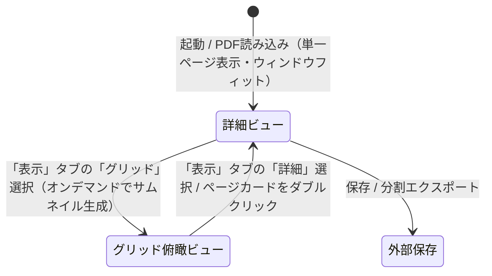

# PDF Binder 基本設計書 (Basic Design)

本書は、Windowsデスクトップ向けPDF編集・バインダー管理・手書きアノテーションアプリケーション「PDF Binder」のシステム構成、アーキテクチャ、機能仕様、画面設計、およびデータ構造を定義する正本ドキュメントです。

---

## 1. システム概要と基本方針

### 1.1 アプリケーションの目的
「PDF Binder」は、複数のPDFファイルの結合・分割・ページの並び替え・回転・白紙追加といった「バインダーとしての文書整理」と、タッチペンやマウスによる「直感的な手書きアノテーション（ペン・蛍光ペン・直線・消しゴム）」を高次元で統合したWindows向けデスクトップアプリケーションです。

### 1.2 コア設計原則
1. **ポータブル＆完全オフライン**: 外部ネットワーク接続を一切必要とせず、ランタイム同梱の自己完結版（Self-Contained 単一EXE形式 / 部分トリミング・ReadyToRun適用）およびOSの .NET 10 を活用した最速・軽量版（Framework-Dependent DLL分離形式 / ReadyToRun適用）の二系統発行に対応すること。
2. **非破壊編集＆安全なファイル管理**: 読み込み元PDFを排他ロックせず、メモリ/一時ストレージを活用して安全な「上書き保存」「別名で保存」を実現すること。
3. **オープンソース（OSS）ライセンス適合**: 商用利用制限や強力なコピーレフト（AGPL等）のない寛容型ライセンス（MIT / Apache-2.0 / BSD）のコンポーネントのみで構成すること。
4. **高品位アノテーション**: 手書きストロークはベクター情報および高解像度透過レンダリングのハイブリッドにより、印刷・拡大時にもボケや劣化のないPDF出力を行うこと。

### 1.3 アプリケーション起動仕様とファイル連携
1. **通常起動**:
   - 引数なしで起動された場合、初期状態（空ドキュメント）でメインウィンドウを表示する。
2. **「プログラムから開く」および関連付け起動**:
   - コマンドライン引数に対象PDFファイルパスが渡された場合、自動的にそのPDFを読み込んで詳細ビューを表示する。
   - 複数ファイルが渡された場合は、最初のファイルを現在のプロセスで開き、2つ目以降のファイルはそれぞれ独立した別プロセス（`Process.Start`）として起動して個別ウィンドウで開く。
   - 存在しないファイルや無効な引数が渡された場合は、エラー通知を表示し、アプリ自体は空ドキュメントの初期状態で安全に起動を継続する。
3. **ウィンドウ状態・サイズの復元**:
   - 前回終了時のウィンドウサイズ（幅・高さ）および最大化状態を `settings.json`（EXE同階層、完全ポータブル仕様）に自動保存し、次回起動時に復元する。
   - 画面解像度・作業領域（`SystemParameters.WorkArea`）を超える場合は画面内に収まるよう自動調整する。

---

## 2. 技術スタック・ライブラリ選定

| カテゴリ | 採用技術 / ライブラリ | ライセンス | 用途・選定理由 |
| :--- | :--- | :--- | :--- |
| **プラットフォーム** | .NET 10.0 (`net10.0-windows`) | MIT | 最新の高DPI対応、高速なJIT/GC、WPFの性能改善を活用 |
| **UIフレームワーク** | WPF (Windows Presentation Foundation) | MIT | 成熟した `InkCanvas` による手書き・筆圧・消しゴム機能、強力なドラッグ＆ドロップ |
| **デザイン/スタイル** | WPF-UI または モダンFluentスタイル | MIT | Windows 11準拠の洗練された角丸・アクリル外観の実現 |
| **MVVM基盤** | CommunityToolkit.Mvvm | MIT | 軽量・高パフォーマンスな `ObservableObject`, `RelayCommand` |
| **PDF構造操作** | PdfSharp (v6.x+) | MIT | ページの回転、並び替え、削除、結合、分割、空白ページ追加、PDF保存 |
| **PDFレンダリング** | PDFium / PDFiumSharp | Apache-2.0 / BSD | Chromiumで実証済みの高速・高精細なサムネイルおよび画面描画 |
| **単体テスト** | xUnit, FluentAssertions | Apache-2.0 / MIT | ロジックの網羅的自動テスト |

---

## 3. ソリューションおよびプロジェクト構成

```text
PDFBinder/
├── .gitignore
├── GEMINI.md                     # プロジェクト開発規約・運用制約（厳守事項）
├── icon.png                      # 正本アプリアイコン
├── README.md                     # プロジェクト概要・ビルド手順
├── PDFBinder.sln                 # ソリューション定義
├── docs/
│   ├── basic_design.md           # 本書（基本設計書）
│   ├── PROJECT.md                # 機能インベントリ・進捗管理
│   └── plans/                    # 実装計画およびWalkthroughの永続アーカイブ
├── src/
│   ├── PDFBinder.Core/           # UI非依存のドメイン・PDF操作・レンダリング層
│   │   ├── Models/               # PDFドキュメント、ページ、インクストロークモデル
│   │   ├── Services/             # PdfService, RenderingService, UndoService
│   │   └── Common/               # ユーティリティ、例外定義
│   └── PDFBinder.App/            # WPF UI層（Views, ViewModels, Behaviors, Styles）
│       ├── Views/                # MainWindow, GridView, DetailEditorView
│       ├── ViewModels/           # MainViewModel, GridViewModel, DetailEditorViewModel
│       ├── Controls/             # CustomInkCanvas, ThumbnailCard
│       ├── Converters/           # 各種ValueConverter
│       └── Assets/               # アイコンリソース
└── tests/
    └── PDFBinder.Tests/          # 単体テストプロジェクト（xUnit）
```

---

## 4. データモデル設計

### 4.1 `PdfPageModel`
バインダー内の個別ページを表現するモデル。
- `PageId`: `Guid` (一意なページID)
- `SourceFilePath`: `string?` (元ファイルパス、空白ページの場合はnull)
- `OriginalPageIndex`: `int` (元ファイル内でのインデックス)
- `OriginalRotation`: `PageRotation` (元PDFファイル読み込み時の初期回転角度)
- `Rotation`: `PageRotation` (現在の回転角度: 0°, 90°, 180°, 270°)
- `RenderRotation`: `PageRotation` (PDFiumレンダリング時に追加適用する差分回転角度)
- `Width`: `double` (ポイント単位)
- `Height`: `double` (ポイント単位)
- `DisplayWidth`: `double` (回転考慮後の表示上の幅)
- `DisplayHeight`: `double` (回転考慮後の表示上の高さ)
- `Thumbnail`: `BitmapSource?` (画面プレビュー用キャッシュビットマップ)
- `InkStrokes`: `StrokeCollection` (WPFインクストロークコレクション)
- `IsModified`: `bool` (編集フラグ)
- `IsThumbnailDirty`: `bool` (サムネイル再生成フラグ)

### 4.2 `PdfDocumentModel`
現在作業中のバインダー全体を表現するモデル。
- `FilePath`: `string?` (現在開いているファイルのパス)
- `Pages`: `ObservableCollection<PdfPageModel>` (ページ順序リスト)
- `IsModified`: `bool` (未保存変更の有無)
- `CanUndo` / `CanRedo`: `bool` (アンドゥ・リドゥ可能状態)

### 4.3 `AppSettings` / `WindowSettings`
アプリ全体の設定およびウィンドウ状態の永続化モデル。
- `Window.Width`: `double` (ウィンドウ幅、既定値: 1100)
- `Window.Height`: `double` (ウィンドウ高さ、既定値: 760)
- `Window.IsMaximized`: `bool` (最大化状態フラグ、既定値: false)

---

## 5. 主要サービスインターフェース設計

### 5.1 `IPdfService`
PDFファイルの入出力、構造操作を担当。
- `Task<PdfDocumentModel> LoadDocumentAsync(string filePath)`: ファイルロックを行わずメモリ読み込み
- `Task SaveDocumentAsync(PdfDocumentModel doc, string outputPath)`: ページ配置・回転・インク合成を行い保存
- `PdfPageModel CreateBlankPage(double width, double height)`: 指定サイズの白紙ページ生成
- `Task AppendPdfAsync(PdfDocumentModel doc, string filePath, int insertIndex)`: 別PDFのページ差し込み結合
- `Task ExportPagesAsync(IEnumerable<PdfPageModel> pages, string outputPath)`: 選択ページの分割抽出

### 5.2 `IPdfRenderer`
PDFページの画面表示用ビットマップ生成およびストローク合成を担当。
- `Task<BitmapSource?> RenderPageAsync(string? filePath, int pageIndex, int targetWidth, int targetHeight, PageRotation rotation)`: サムネイル/詳細画面用レンダリング（サムネイル: 360x504px基準固定生成、詳細画面: 216 DPI相当 / 3.0倍スケール）
- `BitmapSource CreateBlankPageBitmap(int targetWidth, int targetHeight, PageRotation rotation)`: 白紙レンダリング
- `BitmapSource CompositeStrokes(BitmapSource baseImage, StrokeCollection strokes, double originalPageWidth, double originalPageHeight)`: 手書きストローク（InkStrokes）の縮小合成描画（グリッド一覧反映用）

### 5.3 `IUndoRedoService`
ページ操作およびインク操作の履歴管理。
- `Execute(IUndoableCommand command)`
- `Undo()`, `Redo()`
- `Clear()`

### 5.4 `ISettingsService`
アプリケーション設定（`settings.json`）の読み込み・保存管理。
- `AppSettings Load()`: 設定読み込み（未存在または破損時は既定値返却）
- `void Save(AppSettings settings)`: 設定保存（例外安全）

---

## 6. 画面設計とUI/UXフロー

### 6.1 画面モード構成
アプリは **「詳細ビュー（単一ページ／連続表示）」** を基本（デフォルト）画面とし、ページ一覧の確認や自由な並び替えを行う時のみ **「グリッド俯瞰ビュー（Binder Overview）」** へ切り替えて使用します。詳細ビュー内では、「単一ページ表示（初期値）」と「連続表示」を切り替えて利用できます。



### 6.2 統合タイトルバー＆メインツールバー（モダンリボンスタイル）
- **統合タイトルバー兼タブバー（Chrome / Edge スタイル）**:
  - Windows標準のタイトルバーを廃止し、最上段（高さ38px）にアプリアイコン、タブバー、ファイル名表示、ウィンドウキャプションボタンを1段に統合。
  - **左端**: 正本アプリアイコン（18x18px、ドラッグ可能）。
  - **タブ配置**: 「PDF編集」「手書き」「表示」タブ。選択中のタブは下部の白ツールバー領域とシームレスに結合。
  - **中央部**: 現在開いているファイル名（未読み込み時は非表示）を薄いグレーで表示。この領域を含む余白全体がウィンドウドラッグ移動およびダブルクリック最大化/復元に対応。
  - **右端**: Windows標準スタイルのキャプションボタン（最小化、最大化/復元、閉じる[ホバーで赤ハイライト]）。
  - **ウィンドウ制御**: `WindowChrome` を使用し、Windows 11 Snap Layouts や境界リサイズ、最大化時のパディング自動補正に対応。
- **リボンタブ構成**:
  - **「PDF編集」タブ**: ファイル操作およびドキュメント構成の編集（常時利用可能）
    - ファイル操作: 開く (`Ctrl+O`), 追加, 保存 (`Ctrl+S`), 別名保存 (`Ctrl+Shift+S`)
    - ページ構成・抽出: 白紙追加 (`Ctrl+B`), 選択抽出, 全分割
    - ページ編集: 左回転 (`Ctrl+L`), 右回転 (`Ctrl+R`), 削除 (`Delete` / ホバー時赤ハイライト)
      - ※詳細ビュー表示時、特定ページが明示選択されていない場合は現在操作・表示中のカレントページを対象として回転・削除・白紙挿入が実行される。
    - 履歴操作: 元に戻す (`Ctrl+Z`), やり直す (`Ctrl+Y`)
  - **「手書き」タブ**: 詳細ビュー表示時のみ選択可能（グリッドビュー時は非活性化、グリッド切替時は他タブへ自動遷移）
    - ツール: 選択 (`Cursor`), ペン (`Pen`), 蛍光ペン (`Highlighter`), 全体消し (`EraserStroke`), 部分消し (`EraserPoint`), 移動 (`Pan`)
    - 描画オプション（直線・太さ・色）:
      - 直線トグル: ペンまたは蛍光ペン使用時のみ有効化可能なトグルボタン（ON時は十字カーソルで直線描画、ツール切り替え時に自動リセット）
      - 太さプリセット: 選択中ツールに応じた4種ドット（●）ボタン。選択中の太さは薄青背景（`#DBEAFE`）と青枠線（`#2563EB`）で強調表示。ペン時は `0.5px`, `1.0px`, `2.0px`, `4.0px`（初期値 `1.0px`）、蛍光ペンおよび部分消しゴム時は `8.0px`, `12.0px`, `16.0px`, `24.0px`（初期値 `12.0px`、部分消しゴムは円形 `EllipseStylusShape`）。ペン・蛍光ペン・部分消しゴム選択時のみ有効。
      - カラーパレット: 5色プリセット（黒 `#000000`、鮮やかな赤 `#EF4444`、鮮やかな青 `#2563EB`、鮮やかな緑 `#16A34A`、鮮やかな黄 `#EAB308`）。選択中の色にチェックマーク（✓）を表示。ペンおよび蛍光ペン選択時のみ有効。
      - ツール状態の独立保持: ペン（色・太さ）、蛍光ペン（色・太さ）、部分消しゴム（太さ）を切り替えても直前の各設定が独立して記憶・保持される。
  - **「表示」タブ**: ビュー切り替え、表示オプション、ページ配置およびズーム操作の一本化
    - ビュー切り替え: 「詳細」ラジオボタン（手書き・閲覧詳細表示）、「グリッド」ラジオボタン（サムネイル一覧表示）
    - 表示オプション（詳細ビュー時のみ有効、ラジオボタングループ）:
      - 「100%」: 等倍（1.0倍）表示
      - 「ウィンドウにあわせる」（初期値）: 表示領域（ウィンドウ）に1ページ全体が収まるように自動調整。単一ページ表示時は外側Padding（20px）および影用マージン（20px）、セーフティバッファを考慮し、縦横スクロールバーが一切表示されず、ページの上下左右の影が完全に美しく収まるように計算。画面サイズに余裕がある際は上下左右中央（Center）に配置。
      - 「幅にあわせる」: 表示領域の横幅いっぱいに収まるように自動調整。縦スクロールが発生する場合は垂直スクロールバー幅を見越して幅を自動補正し、水平スクロールバーの発生を防止。
      - ※単一ページ表示時はページ切り替え時にも新ページの寸法に合わせ自動再計算。連続表示時はスクロール途中で拡大率を変更せず、ボタン押下時やウィンドウリサイズ時のみカレントページ基準で再計算。
    - ページ配置（詳細ビュー時のみ有効、ラジオボタングループ）:
      - 「単一」（初期値）: 1ページずつ表示。マウスホイール操作時にページ全体が収まっている時は前後のページへ即座にめくり、拡大表示中はページ内をスクロールして上下端に達した状態で前後のページへ切り替え。
      - 「連続」: 全ページを縦に並べて連続スクロール表示。
    - ズーム操作: 縮小 (`Ctrl+-`), 倍率表示/リセット (`Ctrl+0`), 拡大 (`Ctrl++`)
      - 詳細ビュー時: ページ表示倍率（50%〜3200%）を操作、高倍率に応じた適応型スナップ目盛り（50%〜3200%の23段階）により直感的に拡大縮小、クリックで等倍（100%）にリセット
      - グリッドビュー時: サムネイルサイズ（140px〜360px、初期値220px）を操作、初期値220pxを100%とした比率表示およびリセット
    - ページナビゲーションショートカット: `PageUp` / `↑` / `←`（前ページへ移動）、`PageDown` / `↓` / `→`（次ページへ移動）。手書き中やスクロールビューア内などフォーカス位置を問わず確実に動作（※テキストボックス編集中はテキスト編集を優先）

### 6.3 下部ステータスバー（モダン高機能・半透明ステータスバー）
コンテンツ表示領域の下端に重ねて配置する半透明オーバーレイ方式（上部境界線 `#B0CBD5E1`、半透明白 `#99FFFFFF`）を採用し、背後のコンテンツを上品に透過表示。高さを約5px拡大（MinHeight 42px、Padding 12,5）し、各コントロールのサイズ（ボタン 28x28px、入力欄 26px）を拡大して視認性とクリックしやすさを向上。単一ページ表示（FitToWindow）時のスクロールバー誤出現を防ぐため、エディタ側の余白整合性を保持。
- **配置**: コンテンツ領域の最前面下部にオーバーレイ配置（`Panel.ZIndex="10"`）
- **左端（ページナビゲーション）**:
  - 書式: `< ページ [ 1 ] / 2 >`
  - 前へボタン (`<`): 前のページへスクロール移動（先頭ページまたはグリッドビュー時は非活性）
  - ページ番号入力欄 (`[ 1 ]`): 現在表示中のページ番号を表示。直接数値を入力して Enter キーまたはフォーカスアウトで対象ページへ即時ジャンプ可能（詳細ビュー時のみ有効）
  - 総ページ数表示 (`/ 2`): ドキュメントの総ページ数を表示
  - 次へボタン (`>`): 次のページへスクロール移動（末尾ページまたはグリッドビュー時は非活性）
- **中央（ステータス表示）**:
  - 現在の操作状況やファイル読み込み完了メッセージ、ページ状況を動的表示
- **右端（プログレス＆ズームコントロール）**:
  - 非同期処理中のプログレスバー
  - ズームコントロール: `[-] 100% [+]`
    - 縮小ボタン (`-`): 拡大率を1段階縮小（表示タブの縮小コマンドと連動）
    - 倍率表示・等倍リセットボタン: 現在の拡大率（%）を表示、クリックで等倍（100%）にリセット
    - 拡大ボタン (`+`): 拡大率を1段階拡大（表示タブの拡大コマンドと連動）

### 6.4 グリッド俯瞰ビュー
- **未読み込み時の初期表示（詳細ビューと共通）**:
  - ドキュメントが0ページの場合、中央にウェルカムカード（📄アイコン、「PDFファイルを開くか、ここにドラッグ＆ドロップしてください」、「ファイルを開く...」ボタン）を表示
- **外部ファイルドラッグ＆ドロップ（詳細ビューと共通）**:
  - ドキュメント読み込み済みの状態で外部PDFファイルをドラッグすると、メイン表示領域全体に半透明のドロップ案内オーバーレイ（「ここにPDFをドロップして末尾に追加・結合」）を表示
  - ドロップされたPDFを末尾に順次追加結合（未読み込み時は新規オープン）
- **サムネイルグリッド**:
  - 表示タブで「グリッド」が選択された時に初めてオンデマンドで未生成サムネイルを非同期生成（読み込み時の高速化）
  - ドラッグ＆ドロップによる自由なページ順序入れ替え（ドロップインジケーター表示）
  - 複数選択（Shift+クリック、Ctrl+クリック）対応
  - 各カード上に「ページ番号」「回転ボタン」「削除ボタン」のクイックオーバーレイ
  - カードダブルクリックにより詳細ビューへ瞬時に切り替わり、該当ページへ自動スクロール

### 6.5 詳細手書きエディタビュー（単一ページ／縦連続表示）
- **未読み込み時の初期表示・ドラッグ＆ドロップ（グリッドビューと共通）**:
  - ドキュメントが0ページの場合、グリッドビューと同様のウェルカムカード（📄アイコン、「PDFファイルを開くか、ここにドラッグ＆ドロップしてください」、「ファイルを開く...」ボタン）を表示
  - 外部PDFファイルのドラッグ＆ドロップに対応し、読み込み済み時は共通ドロップ案内オーバーレイを表示。ドロップ後は現在のスクロール位置を維持
- **画面構成**:
  - **単一ページ表示（初期値）**: 現在のページ（`CurrentPage`）のみを画面中央に配置。画面内に用紙が収まっている場合はマウスホイールで即座に前後のページをめくり、拡大表示中はページ内をスクロールして上下端に達した状態でスムーズに前後のページへ切り替え。固定クールダウンを排したホイール回転量（Delta累積）方式により、高速回転時の即時追従と回転途切れ時の端数リセットを実現。
  - **連続表示**: 全ページが縦一列に並ぶ連続スクロールリスト（`ScrollViewer` ＋ `ItemsControl`）。スクロール途中で拡大率を変更せず固定維持。
  - 各用紙カードはドロップシャドウ付きの用紙境界を持ち、用紙外の余白を保ったすっきりとしたドキュメントリーダー外観
  - ステータスバーに現在表示・操作中のページ番号（例:「ページ 3 / 10」）を動的表示
- **キャンバスエリア**:
  - 各ページごとに背景PDFレンダリング画像、確定済みストロークキャッシュ画像（透過）、および前面 `EditorInkCanvas` を配置
  - **ストローク・ビットマップキャッシュ層 & 描画パイプライン最適化**:
    - `DropShadowEffect` をページコンテンツ親枠から影専用の独立背景要素に分離し、手書き入力中の毎フレーム全画面ピクセルシェーダー再計算・再ラスタライズを根絶
    - ペン・蛍光ペン筆記時は確定済みストロークを高精細透過ビットマップ（`StrokeCache`）として表示し、`EditorInkCanvas` 自身は「現在描画中の1ストロークのみ」を保持。既存ストローク数に関わらず描画負荷を常にゼロ本相当に抑え、極小レイテンシでの滑らかなペン追従性を実現
    - 消しゴム（ストローク消し・部分消し）・選択ツール時は全ベクターストロークを `EditorInkCanvas` に展開して直接編集を行い、編集完了後またはペンモード復帰時にキャッシュ画像を自動再生成
    - ズーム変更時はデバウンス制御（150ms）と同期して最新ズーム解像度に応じた高品質キャッシュを動的追従生成
  - スケール連動（`LayoutTransform` / `ScaleTransform`）により、全ページ一括での滑らかな拡大・縮小
  - デバウンス制御（150ms）、ダブルバッファリング、世代番号管理により、ズーム時のチラつき（フリッカー）や非同期競合を完全に防止
  - **パームリジェクション & マルチタッチジェスチャー**:
    - スタイラスペン（デジタイザー）と手指タッチの完全分離
    - スタイラスペン使用時: ツールに応じた常時描画・消去
    - 手指1本タッチ: 画面のスムーズなパン（スクロール移動）
    - 手指2本タッチ: 指の中心座標を基準としたピンチズーム（拡大・縮小）＆スクロール連動
    - パームリジェクション: ペン接地中および近接（ホバー）中はタッチ操作を一時抑止し、筆記時の手首接触による画面揺れを防止
    - マウス操作: ツールバーの「移動」選択でドラッグスクロール、ペン選択で描画、ホイールでスクロールを維持

### 6.6 未保存変更の保護フロー（終了時および別ファイルオープン時）
ドキュメントに未保存の変更（ページの追加・並び替え・削除・回転・白紙追加、手書き描画など）が存在する場合、アプリケーション終了時（ウィンドウの [X] ボタン、Alt+F4 等）および「別のPDFを開く」操作時にモダンなインアプリ・モーダルオーバーレイ（半透明暗転背景＋中央カード型ダイアログ）を表示し、誤ったデータ喪失を確実に防止します。
- **閲覧のみ（未編集）**: ダイアログを表示せず即座に終了または新規オープンを実行。
- **ダイアログの表示形態**: メインウィンドウ前面に暗転レイヤー（Scrim）と角丸 Fluent カードを配置。外側クリックによる誤破棄を遮断し、Esc キーによる安全なキャンセルをサポート（誤打鍵防止のため Enter キーでの自動保存は無効化）。
- **ダイアログの選択肢**:
  - **保存 (Save)**: ドキュメントを保存（ファイルパス未設定時は「名前を付けて保存」ダイアログを表示）し、成功後に終了または別ファイルオープンを実行。保存ダイアログのキャンセルや保存失敗時は終了/オープンを中断。
  - **保存しない (Discard)**: 変更内容を破棄し、そのまま終了または別ファイルオープンを実行。
  - **キャンセル (Cancel)**: 操作を中断し、ダイアログを閉じて現在の編集状態を維持。
- **手書き変更の判定**: 一度でも編集（文字追加・消去など）が行われた場合は、すべて消去された場合でも未保存変更あり（Dirty）として扱います。

---

## 7. 手書きアノテーションのPDF合成・保存仕様

PDFへのインク反映は、画質とファイルサイズ、PDF標準互換性を両立するハイブリッド方式を採用します。
1. **ベクター出力（ペン・直線）**:
   - `PdfSharp` の `XGraphics.DrawLines` / `DrawPath` を用い、ストロークの座標点配列をベクターパスとして直接PDFのコンテンツストリームに書き込みます。
   - これにより、拡大・印刷時にも劣化せず、極小ファイルサイズを維持します。
2. **半透明ハイライト出力（蛍光ペン）**:
   - 蛍光ペンの透過ブレンド（Multiply / Alpha Transparency）はPDFリーダー依存の表示崩れを防ぐため、ハイライトストローク領域を高DPI透過PNGとしてレンダリングし、`XGraphics.DrawImage` でページの上に重ねて合成します。
3. **元ドキュメントの非破壊保持**:
   - 元のテキストやベクター図面は一切再エンコード・不可逆圧縮せず、新規コンテンツレイヤーとしてインクを上書き追記します。

---

## 8. 非機能要件・品質基準

1. **応答性**:
   - 100ページ以上のPDFでもUIフリーズなくスムーズにスクロールできる仮想化（`VirtualizingWrapPanel`）の採用。
   - サムネイル生成はバックグラウンドワーカースレッド（`Task.Run`）で非同期生成し、順次UIへ反映。
2. **堅牢性**:
   - 不正なPDF、破損ページ、パスワード保護PDFに対する適切なエラーハンドリングとダイアログ通知。
3. **テスト自動化**:
   - `PDFBinder.Core` 内のページ操作、マージ、スプリット、白紙挿入の単体テスト網羅率100%（全テストPASS必須）。
