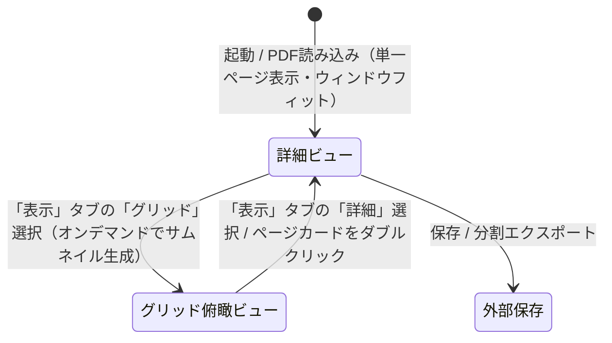

# PDF Binder 基本設計書 (Basic Design)

本書は、Windowsデスクトップ向けPDF編集・バインダー管理・手書きアノテーションアプリケーション「PDF Binder」のシステム構成、アーキテクチャ、機能仕様、画面設計、およびデータ構造を定義する正本ドキュメントです。

---

## 1. システム概要と基本方針

### 1.1 アプリケーションの目的
「PDF Binder」は、複数のPDFファイルの結合・分割・ページの並び替え・回転・白紙追加といった「バインダーとしての文書整理」と、タッチペンやマウスによる「直感的な手書きアノテーション（ペン・蛍光ペン・直線・消しゴム）」を高次元で統合したWindows向けデスクトップアプリケーションです。

### 1.2 コア設計原則
1. **ポータブル＆完全オフライン**: 外部ネットワーク接続を一切必要とせず、ランタイム同梱の自己完結版（Self-Contained 単一EXE形式 / 部分トリミング・ReadyToRun適用）およびOSの .NET 10 を活用した最速・軽量版（Framework-Dependent DLL分離形式 / ReadyToRun適用）の二系統発行に対応すること。
2. **非破壊編集＆安全なファイル管理**: 読み込み元PDFを排他ロックせず、メモリ/一時ストレージを活用して安全な「上書き保存」「別名で保存」を実現すること。
3. **オープンソース（OSS）ライセンス適合**: 商用利用制限や強力なコピーレフト（AGPL等）のない寛容型ライセンス（MIT / Apache-2.0 / BSD）のコンポーネントのみで構成すること。
4. **高品位アノテーション**: 手書きストロークはベクター情報および高解像度透過レンダリングのハイブリッドにより、印刷・拡大時にもボケや劣化のないPDF出力を行うこと。

### 1.3 アプリケーション起動仕様とファイル連携
1. **通常起動および複数ウィンドウ管理**:
   - 引数なし（ショートカットやスタートメニュー等）で起動された場合、新規ウィンドウを立ち上げ、ドキュメント未読み込み状態（0件）で表示する。
   - 未読み込み状態で「白紙追加」を押下した場合、新規ドキュメント「名称未設定.pdf」（白紙1ページ）が生成され、アクティブ化される。
   - 単一プロセス内で複数ウィンドウ（`MainWindow`）を一括管理し、すべてのウィンドウが閉じられた時点でプロセスを安全に終了する（`ShutdownMode.OnLastWindowClose`）。
2. **「プログラムから開く」、関連付け起動およびタブ統合（Single Instance & IPC）**:
   - PDFファイルの関連付けダブルクリックやコマンドライン引数でファイルが指定された場合、名前付きミューテックスおよび名前付きパイプ（Named Pipe）を用いて単一インスタンス制御を行う。
   - 既に起動中のプロセスが存在する場合、直近に操作・アクティブだった既存ウィンドウの新しいタブ（新規セッション）としてPDFファイルを開く。
   - 対象の既存ウィンドウが最小化または背面に隠れている場合は、自動的に最前面（アクティブ状態）に復元してフォーカスを設定する。
   - 既に開かれているファイルと同一パスが指定された場合は、重複オープンを行わず既存のタブへ即座に切り替える。
   - 複数ファイルが渡された場合は、順次新規タブとして同一ウィンドウ内に追加する。
   - コマンドライン引数に `--new-window`（または `-n`）が指定された場合は、ファイル指定時であっても既存タブではなく新規ウィンドウを立ち上げて開く。
   - 存在しないファイルや無効な引数が渡された場合は、エラー通知を表示し、アプリ自体は安全に動作を継続する。
3. **ウィンドウ状態・サイズの復元**:
   - 前回終了時のウィンドウサイズ（幅・高さ）および最大化状態を `settings.json`（EXE同階層、完全ポータブル仕様）に自動保存し、次回起動時に復元する。
   - 画面解像度・作業領域（`SystemParameters.WorkArea`）を超える場合は画面内に収まるよう自動調整する。

---

## 2. 技術スタック・ライブラリ選定

| カテゴリ | 採用技術 / ライブラリ | ライセンス | 用途・選定理由 |
| :--- | :--- | :--- | :--- |
| **プラットフォーム** | .NET 10.0 (`net10.0-windows`) | MIT | 最新の高DPI対応、高速なJIT/GC、WPFの性能改善を活用 |
| **UIフレームワーク** | WPF (Windows Presentation Foundation) | MIT | 成熟した `InkCanvas` による手書き・筆圧・消しゴム機能、強力なドラッグ＆ドロップ |
| **デザイン/スタイル** | WPF-UI または モダンFluentスタイル | MIT | Windows 11準拠の洗練された角丸・アクリル外観の実現 |
| **アイコン** | Material Symbols Outlined (Google Fonts) | Apache-2.0 | アプリ全体で統一されたアウトラインデザインのオープンソースアイコン（リソース完全内包・完全オフライン動作） |
| **MVVM基盤** | CommunityToolkit.Mvvm | MIT | 軽量・高パフォーマンスな `ObservableObject`, `RelayCommand` |
| **PDF構造操作** | PdfSharp (v6.x+) | MIT | ページの回転、並び替え、削除、結合、分割、空白ページ追加、PDF保存 |
| **PDFレンダリング** | PDFium / PDFiumSharp | Apache-2.0 / BSD | Chromiumで実証済みの高速・高精細なサムネイルおよび画面描画 |
| **単体テスト** | xUnit, FluentAssertions | Apache-2.0 / MIT | ロジックの網羅的自動テスト |

---

## 3. ソリューションおよびプロジェクト構成

```text
PDFBinder/
├── .gitignore
├── GEMINI.md                     # プロジェクト開発規約・運用制約（厳守事項）
├── icon.png                      # 正本アプリアイコン
├── README.md                     # プロジェクト概要・ビルド手順
├── PDFBinder.sln                 # ソリューション定義
├── docs/
│   ├── basic_design.md           # 本書（基本設計書）
│   ├── PROJECT.md                # 機能インベントリ・進捗管理
│   └── plans/                    # 実装計画およびWalkthroughの永続アーカイブ
├── src/
│   ├── PDFBinder.Core/           # UI非依存のドメイン・PDF操作・レンダリング層
│   │   ├── Models/               # PDFドキュメント、ページ、インク、印刷設定モデル
│   │   ├── Services/             # PdfService, RenderingService, UndoService, PrintLayoutCalculator, IPrintService
│   │   └── Common/               # ユーティリティ、例外定義
│   └── PDFBinder.App/            # WPF UI層（Views, ViewModels, Behaviors, Styles）
│       ├── Views/                # MainWindow, GridView, DetailEditorView
│       ├── ViewModels/           # MainViewModel, GridViewModel, DetailEditorViewModel, PrintViewModel
│       ├── Services/             # WpfPrintService
│       ├── Models/               # DocumentSession
│       ├── Controls/             # CustomInkCanvas, ThumbnailCard
│       ├── Converters/           # 各種ValueConverter
│       └── Assets/               # アイコンリソース
│           └── Fonts/            # Material Symbols Outlined フォントファイル (.ttf)
└── tests/
    └── PDFBinder.Tests/          # 単体テストプロジェクト（xUnit）
```

---

## 4. データモデル設計

### 4.1 `PdfPageModel`
バインダー内の個別ページを表現するモデル。
- `PageId`: `Guid` (一意なページID)
- `SourceFilePath`: `string?` (元ファイルパス、空白ページの場合はnull)
- `OriginalPageIndex`: `int` (元ファイル内でのインデックス)
- `OriginalRotation`: `PageRotation` (元PDFファイル読み込み時の初期回転角度)
- `Rotation`: `PageRotation` (現在の回転角度: 0°, 90°, 180°, 270°)
- `RenderRotation`: `PageRotation` (PDFiumレンダリング時に追加適用する差分回転角度)
- `Width`: `double` (ポイント単位)
- `Height`: `double` (ポイント単位)
- `DisplayWidth`: `double` (回転考慮後の表示上の幅)
- `DisplayHeight`: `double` (回転考慮後の表示上の高さ)
- `Thumbnail`: `BitmapSource?` (画面プレビュー用キャッシュビットマップ)
- `InkStrokes`: `StrokeCollection` (WPFインクストロークコレクション。ページ回転時は `InkTransformHelper` により自動的に幾何学追従回転)
- `IsModified`: `bool` (編集フラグ)
- `IsThumbnailDirty`: `bool` (サムネイル再生成フラグ)
- `RotateTo(PageRotation newRotation)`: 指定角度へページを回転し、インクストロークも連動して幾何学変換
- `RotateClockwise()`: 時計回り90度回転（インク追従）
- `RotateCounterClockwise()`: 反時計回り90度回転（インク追従）

### 4.2 `PdfDocumentModel`
現在作業中のバインダー全体を表現するモデル。
- `FilePath`: `string?` (現在開いているファイルのパス)
- `Pages`: `ObservableCollection<PdfPageModel>` (ページ順序リスト)
- `IsModified`: `bool` (未保存変更の有無)
- `CanUndo` / `CanRedo`: `bool` (アンドゥ・リドゥ可能状態)

### 4.3 `DocumentSession`
1つの開いているPDFドキュメントの作業状態（データ、履歴、表示コンテキスト）をカプセル化するモデル。
- `Document`: `PdfDocumentModel` (PDFドキュメントデータ)
- `UndoRedoService`: `IUndoRedoService` (ドキュメント専用のアンドゥ・リドゥ履歴)
- `IsDetailViewActive`: `bool` (詳細ビュー/グリッドビュー状態)
- `CurrentPageNumber`: `int` (現在表示中のページ番号)
- `ZoomFactor`: `double` (詳細エディタのズーム倍率)
- `SelectedRibbonTabIndex`: `int` (選択中のリボンタブ)
- `IsActive`: `bool` (現在アクティブに表示中かどうか)
- `DisplayTitle`: `string` (プルダウン用表示名。未保存変更時は末尾に `*` を付与)
- `FullPathOrTitle`: `string` (ツールチップ用フルパスまたは未設定名)

### 4.4 `AppSettings` / `WindowSettings`
アプリ全体の設定およびウィンドウ状態の永続化モデル。
- `Window.Width`: `double` (ウィンドウ幅、既定値: 1100)
- `Window.Height`: `double` (ウィンドウ高さ、既定値: 760)
- `Window.IsMaximized`: `bool` (最大化状態フラグ、既定値: false)

---

## 5. 主要サービスインターフェース設計

### 5.1 `IPdfService`
PDFファイルの入出力、構造操作を担当。
- `Task<PdfDocumentModel> LoadDocumentAsync(string filePath)`: ファイルロックを行わずメモリ読み込み
- `Task SaveDocumentAsync(PdfDocumentModel doc, string outputPath)`: ページ配置・回転・インク合成を行い保存
- `PdfPageModel CreateBlankPage(double width, double height)`: 指定サイズの白紙ページ生成
- `Task AppendPdfAsync(PdfDocumentModel doc, string filePath, int insertIndex)`: 別PDFのページ差し込み結合
- `Task ExportPagesAsync(IEnumerable<PdfPageModel> pages, string outputPath)`: 選択ページの分割抽出
- `Task<int> SplitAllPagesAsync(PdfDocumentModel doc, string outputDirectory, string baseFileName)`: 全ページを個別PDFに一括分割
- `Task<List<PdfPageModel>> SplitPagesHalfAsync(IEnumerable<PdfPageModel> pages, CancellationToken cancellationToken)`: ページの向き（表示寸法）に応じて長辺を半分に2分割（横長なら左右分割、縦長なら上下分割）

### 5.2 `IPdfRenderer`
PDFページの画面表示用ビットマップ生成およびストローク合成、インタラクティブデータ抽出を担当。PDFiumネイティブAPI（Docnet.Core）の非スレッドセーフ性を回避するため、`PriorityAsyncLock` による排他・優先度制御（High: カレントページ詳細表示、Low: バックグラウンドサムネイル・先読み）を備え、多重実行によるクラッシュやフリーズを完全に防止。
- `Task<BitmapSource?> RenderPageAsync(string? filePath, int pageIndex, int targetWidth, int targetHeight, PageRotation rotation, CancellationToken cancellationToken = default, RenderPriority priority = RenderPriority.Normal)`: サムネイル/詳細画面用レンダリング（優先度指定対応）
- `BitmapSource CreateBlankPageBitmap(int targetWidth, int targetHeight, PageRotation rotation)`: 白紙レンダリング
- `BitmapSource CompositeStrokes(BitmapSource baseImage, StrokeCollection strokes, double originalPageWidth, double originalPageHeight)`: 手書きストローク（InkStrokes）の縮小合成描画（グリッド一覧反映用）
- `Task<PageInteractiveData> ExtractInteractiveDataAsync(string? filePath, int pageIndex, double displayWidth, double displayHeight, PageRotation rotation, CancellationToken cancellationToken = default, RenderPriority priority = RenderPriority.Normal)`: ページの文字座標（Docnet.Core）およびリンク注釈（PdfSharp）を抽出（テキスト選択・リンク用）

### 5.3 `IUndoRedoService`
ページ操作およびインク操作の履歴管理。
- `Execute(IUndoableCommand command)`
- `Undo()`, `Redo()`
- `Clear()`

### 5.4 `ISettingsService`
アプリケーション設定（`settings.json`）の読み込み・保存管理。
- `AppSettings Load()`: 設定読み込み（未存在または破損時は既定値返却）
- `void Save(AppSettings settings)`: 設定保存（例外安全）

### 5.5 `InkTransformHelper`
手書きストロークコレクションの幾何学的座標変換・追従回転を担当するコアヘルパー。
- `void RotateStrokes(StrokeCollection? strokes, PageRotation deltaRotation, double currentDisplayWidth, double currentDisplayHeight)`: WPF ネイティブの `StrokeCollection.Transform(Matrix, false)` を用いた一括アフィン変換により、大量ストロークでも再アロケーションなしに数ミリ秒で追従回転。90度・270度回転時はペン先寸法（`DrawingAttributes.Width`/`Height`）を自動反転。
- `Matrix CreateRotationMatrix(PageRotation deltaRotation, double currentWidth, double currentHeight)`: 差分回転角度と元の用紙寸法に応じた変換行列を作成。
- `(double X, double Y) TransformPoint(double x, double y, PageRotation deltaRotation, double currentWidth, double currentHeight)`: 単一座標点の幾何学的回転変換。

### 5.6 `BitmapTransformHelper`
ビットマップ画像の幾何学的変換（0ms即時回転など）を担当するコアヘルパー。
- `BitmapSource? CreateRotatedBitmap(BitmapSource? source, int deltaDegrees)`: `TransformedBitmap` と `RotateTransform` を用いて、既存のビットマップをメモリ上で即座に回転させたフリーズ済み画像を生成。回転操作直後の引き伸ばし・歪みを完全防止する仮プレビュー表示や、グリッドビューでのサムネイル即時回転に活用。

### 5.7 `StrokeSplitHelper`
手書きストロークコレクションを垂直・水平境界線で幾何学的に切断・分割し、それぞれの新ページローカル座標系へ分配するヘルパー。
- `(StrokeCollection FirstPart, StrokeCollection SecondPart) SplitStrokes(StrokeCollection? strokes, bool splitHorizontally, double splitOffset)`: 境界線（中央線）を跨ぐストロークを線形補間交点で2つに切断し、後半側ストロークの座標オフセットを自動シフトして返却

---

## 6. 画面設計とUI/UXフロー

### 6.1 画面モード構成
アプリは **「詳細ビュー（単一ページ／連続表示）」** を基本（デフォルト）画面とし、ページ一覧の確認や自由な並び替えを行う時のみ **「グリッド俯瞰ビュー（Binder Overview）」** へ切り替えて使用します。詳細ビュー内では、「単一ページ表示（初期値）」と「連続表示」を切り替えて利用できます。



### 6.2 UIデザインシステム＆ダークテーマ仕様
長時間のPDF作業・手書き執筆における目の疲労を軽減し、高コントラストで洗練された操作体験を提供するため、**チャコール系ダークテーマ（無彩色グレー＆VS Codeブルーアクセント、常時ダーク）**に完全移行しています。青みの強いスレート系から彩度の低い自然なエディタ調グレーへ刷新し、作業に集中しやすい落ち着いた作業空間を実現しています。
- **PDF原本用紙の忠実表示**:
  - PDF用紙（紙面）自体は白地（原本色）をそのまま保持し、図面・カラー写真・手書きインクの色合いを忠実に維持します。
  - アプリ外枠、統合タイトルバー、リボンツールバー、フローティングバー、スクロールバー、および各ビューのワークスペース背景をダークカラーで統一し、用紙が美しく浮かび上がるハイコントラストな視認性を実現しています。
- **高精細・ピクセル整合レンダリング＆フォント仕様**:
  - `UseLayoutRounding="True"` をウィンドウ全体に適用し、コントロール配置座標およびサイズを整数物理ピクセル単位へ丸め込むことで、中央寄せ配置時等のサブピクセルずれ（0.5px）による枠線や文字の滲みを根本から防止。
  - `TextOptions.TextFormattingMode="Display"` および `TextOptions.TextRenderingMode="ClearType"` を適用し、文字グリフをディスプレイのピクセルグリッドにスナップ（ヒンティング）させ、特に日本語（漢字・かな）の細線やくっきりとした可読性を確保。
  - 基本フォントファミリとして `AppFontFamily`（`Segoe UI Variable, Segoe UI, Meiryo, sans-serif`）を定義・継承し、アプリ全体で統一されたシャープな文字レンダリングを実現。
- **カスタムスクロールバー**:
  - Windows標準の淡色スクロールバーを廃止し、チャコールダーク背景に馴染むスリムでモダンなカスタムスクロールバースタイル（幅10px、角丸4px、ホバー・ドラッグ対応）を全体適用しています。

#### ダークテーマ カラーパレット定義

| セマンティック名 | カラーコード (Hex) | 用途・説明 |
|---|---|---|
| `AppBackgroundBrush` | `#1E1E1E` (Dark-1) | アプリ全体の最背面（ウィンドウ、グリッド・エディタのワークスペース背景） |
| `HeaderBackgroundBrush` | `#252526` (Dark-2) | 統合タイトルバー／タブバー背景 |
| `RibbonBackgroundBrush` | `#252526` (Dark-2) | リボンツールバー背景 |
| `SurfaceBackgroundBrush` | `#252526` (Dark-2) | カード、フローティングバー、ダイアログ等の基本面 |
| `SurfaceSecondaryBrush` | `#2D2D30` (Dark-3) | サブ領域、コントロール背景、バッジ背景 |
| `SurfaceBorderBrush` | `#3E3E42` (Dark-Border) | 通常の境界線、区切り線 |
| `SurfaceBorderLightBrush` | `#505054` (Dark-BorderLight) | 強調境界線、コントロール外枠 |
| `TextPrimaryBrush` | `#F1F1F1` (Gray-100) | 最前面メインテキスト、アクティブアイコン |
| `TextSecondaryBrush` | `#CCCCCC` (Gray-300) | ラベル、補助テキスト、非アクティブアイコン |
| `TextMutedBrush` | `#858585` (Gray-500) | 無効状態テキスト、控えめなキャプション |
| `AccentBrush` | `#007ACC` (VS Code Blue) | プライマリボタン、選択枠ハイライト |
| `AccentHoverBrush` | `#1F8AD2` (Blue Hover) | アクセントホバー状態 |
| `AccentPressedBrush` | `#094771` (Blue Pressed) | アクセント押下状態 |
| `DangerBrush` | `#F14C4C` (Red-500) | 削除などの危険アクション |
| `DangerHoverBrush` | `#E51400` (Red-600) | 危険アクションホバー状態 |
| `DangerBackgroundHoverBrush` | `#4E1A1A` (Red暗色) | 危険ボタンホバー背景 |
| `ControlHoverBrush` | `#3E3E40` (Hover Gray) | ボタン・タブホバー背景 |
| `ControlPressedBrush` | `#4E4E50` (Pressed Gray) | ボタン・タブ押下背景 |
| `SelectedItemBrush` | `#094771` (Selected Blue) | 選択中アイテム・トグル背景 |
| `ScrollBarThumbBrush` | `#424242` | スクロールバー通常つまみ |
| `ScrollBarThumbHoverBrush` | `#4F4F4F` | スクロールバーホバーつまみ |
| `ScrollBarThumbPressedBrush` | `#686868` | スクロールバードラッグつまみ |

### 6.3 統合タイトルバー＆メインツールバー（モダンリボンスタイル）
- **統合タイトルバー兼タブバー（Chrome / Edge スタイル）**:
  - Windows標準のタイトルバーを廃止し、最上段（高さ38px）にアプリアイコン、タブバー、ファイル名表示、ウィンドウキャプションボタンを1段に統合。
  - **左端**: 正本アプリアイコン（18x18px、ドラッグ可能）。
  - **タブ配置**: 「PDF編集」「手書き」「表示」タブ。選択中のタブは下部の白ツールバー領域とシームレスに結合。
  - **中央部**: 複数ファイル切り替えプルダウン。現在アクティブなファイル名と下向き矢印（▼）をタイトルバーに馴染むフラットボタン形式で表示。クリックすると開いている全ドキュメント一覧がドロップダウン表示され、各項目の選択によるアクティブ切り替え、および右端の「×」ボタンによる個別ファイル終了（未保存時の保存確認付き）に対応。未読み込み時は非表示。この領域以外の余白全体がウィンドウドラッグ移動およびダブルクリック最大化/復元に対応。
  - **右端**: Windows標準スタイルのキャプションボタン（最小化、最大化/復元、閉じる[ホバーで赤ハイライト]）。
  - **ウィンドウ制御**: `WindowChrome` を使用し、Windows 11 Snap Layouts や境界リサイズ、最大化時のパディング自動補正に対応。
- **リボンタブ構成**:
  - **「PDF編集」タブ**: ファイル操作およびドキュメント構成の編集（常時利用可能）
    - ファイル操作: 開く (`Ctrl+O`), 追加, 保存 (`Ctrl+S`), 別名保存 (`Ctrl+Shift+S`), 印刷 (`Ctrl+P`)
    - ページ構成・抽出: 白紙追加 (`Ctrl+B`), 選択抽出, 全分割, ページ分割
    - ページ編集: 左回転 (`Ctrl+L`), 右回転 (`Ctrl+R`), 削除 (`Delete` / ホバー時赤ハイライト)
      - ※詳細ビュー表示時、特定ページが明示選択されていない場合は現在操作・表示中のカレントページを対象として回転・削除・白紙挿入が実行される。
    - 履歴操作: 元に戻す (`Ctrl+Z`), やり直す (`Ctrl+Y`)
  - **「手書き」タブ**: 詳細ビュー表示時のみ選択可能（グリッドビュー時は非活性化、グリッド切替時は他タブへ自動遷移）
    - ツール: 移動 (`Pan` / 初期選択ツール), 文字選択 (`TextSelect` / I-Beamカーソル), ペン (`Pen`), 蛍光ペン (`Highlighter`), 全体消し (`EraserStroke`), 部分消し (`EraserPoint`), ストローク選択 (`Cursor`)
    - テキスト選択・リンク操作（インタラクティブオーバーレイ）:
      - 文字選択ツール時: PDF内の文字をマウスドラッグで自由に矩形・範囲選択でき、半透明ブルーでハイライト表示。`Ctrl+C` や右クリックコンテキストメニュー「コピー」によりクリップボードへテキストをコピー可能。
      - リンク操作: 移動（手のひら）ツール時、PDF内のURLリンクをクリックすると既定ブラウザを起動、ページ内リンクをクリックすると該当ページへ即時ジャンプ。文字選択ツール時は純粋なテキスト選択・コピーを優先し、ペン・消しゴム使用時は手書き入力を最優先することで誤動作を完全防止。
    - 描画オプション（直線・筆圧・太さ・色）:
      - 直線トグル: ペンまたは蛍光ペン使用時のみ有効化可能なトグルボタン（ON時は十字カーソルで直線描画、ツール切り替え時に自動リセット）
      - 筆圧トグル: 直線ボタンの右横に配置。ペン使用時かつ直線モード無効時のみ操作可能なトグルボタン（初期値OFF）。OFF時は線の太さを均一（`IgnorePressure = true`）にし、ON時はスタイラスペンの筆圧に応じた強弱・太さ変化（`IgnorePressure = false`）を反映。ツール切り替え時や別PDF読み込み時も設定状態を保持。
      - 太さプリセット: 選択中ツールに応じた4種ドット（●）ボタン。選択中の太さは薄青背景（`#DBEAFE`）と青枠線（`#2563EB`）で強調表示。ペン時は `0.5px`, `1.0px`, `2.0px`, `4.0px`（初期値 `1.0px`）、蛍光ペンおよび部分消しゴム時は `8.0px`, `12.0px`, `16.0px`, `24.0px`（初期値 `12.0px`、部分消しゴムは円形 `EllipseStylusShape`）。ペン・蛍光ペン・部分消しゴム選択時のみ有効。
      - カラーパレット: 5色プリセット（黒 `#000000`、鮮やかな赤 `#EF4444`、鮮やかな青 `#2563EB`、鮮やかな緑 `#16A34A`、鮮やかな黄 `#EAB308`）。選択中の色にチェックマーク（✓）を表示。ペンおよび蛍光ペン選択時のみ有効。
      - ツール状態の独立保持: ペン（色・太さ）、蛍光ペン（色・太さ）、部分消しゴム（太さ）を切り替えても直前の各設定が独立して記憶・保持される。
  - **「表示」タブ**: ビュー切り替え、表示オプション、ページ配置およびズーム操作の一本化
    - ビュー切り替え: 「詳細」ラジオボタン（手書き・閲覧詳細表示）、「グリッド」ラジオボタン（サムネイル一覧表示）
    - 表示オプション（詳細ビュー時のみ有効、ラジオボタングループ）:
      - 「100%」: 等倍（1.0倍）表示
      - 「ウィンドウにあわせる」（初期値）: 表示領域（ウィンドウ）に1ページ全体が収まるように自動調整。単一ページ表示時は外側Padding（20px）および影用マージン（20px）、セーフティバッファを考慮し、縦横スクロールバーが一切表示されず、ページの上下左右の影が完全に美しく収まるように計算。画面サイズに余裕がある際は上下左右中央（Center）に配置。
      - 「幅にあわせる」: 表示領域の横幅いっぱいに収まるように自動調整。縦スクロールが発生する場合は垂直スクロールバー幅を見越して幅を自動補正し、水平スクロールバーの発生を防止。
      - ※単一ページ表示時はページ切り替え時にも新ページの寸法に合わせ自動再計算。連続表示時はスクロール途中で拡大率を変更せず、ボタン押下時やウィンドウリサイズ時のみカレントページ基準で再計算。
    - ページ配置（詳細ビュー時のみ有効、ラジオボタングループ）:
      - 「単一」（初期値）: 1ページずつ表示。マウスホイール操作時にページ全体が収まっている時は前後のページへ即座にめくり、拡大表示中はページ内をスクロールして上下端に達した状態で前後のページへ切り替え。
      - 「連続」: 全ページを縦に並べて連続スクロール表示。
    - ズーム操作: 縮小 (`Ctrl+-`), 倍率表示/リセット (`Ctrl+0`), 拡大 (`Ctrl++`), マウスホイールズーム (`Ctrl + Wheel`)
      - 詳細ビュー時: ページ表示倍率（50%〜3200%）を操作、高倍率に応じた適応型スナップ目盛り（50%〜3200%の23段階）により直感的に拡大縮小、クリックで等倍（100%）にリセット。単一・連続表示ともに `Ctrl + Wheel` による拡大縮小に対応
      - グリッドビュー時: 詳細ビューと同一の適応型スナップ目盛り（50%〜3200%、基準サイズ220pxに対して110px〜7,040px）により段階的に拡大縮小、クリックで等倍（100% / 220px）にリセット。`Ctrl + Wheel` による直感的な拡大縮小に対応。サムネイル事前生成解像度を倍増（720x1008）し高倍率でも鮮明に表示
    - ページナビゲーションショートカット: `PageUp` / `↑` / `←`（前ページへ移動）、`PageDown` / `↓` / `→`（次ページへ移動）。手書き中やスクロールビューア内などフォーカス位置を問わず確実に動作（※テキストボックス編集中はテキスト編集を優先）

### 6.4 下部ステータスバー（モダン高機能・半透明ステータスバー）
コンテンツ表示領域の下端に重ねて配置する半透明オーバーレイ方式（上部境界線 `#3E3E42`、半透明チャコール `#E6252526`（不透明度90%））を採用し、背後のコンテンツを上品に透過表示。高さを約5px拡大（MinHeight 42px、Padding 12,5）し、各コントロールのサイズ（ボタン 28x28px、入力欄 26px）を拡大して視認性とクリックしやすさを向上。単一ページ表示（FitToWindow）時はステータスバー上部に収まるようフィット領域を補正しスクロールバー誤出現を防止。連続表示およびグリッド表示でも最下部スクロール時に最後のページやサムネイルカードがステータスバーに隠れないよう、下部オフセット（62px）を確保。
- **配置**: コンテンツ領域の最前面下部にオーバーレイ配置（`Panel.ZIndex="10"`、単一・連続表示ともに下部オフセットにより重複を回避）
- **左端（ページナビゲーション）**:
  - 書式: `< ページ [ 1 ] / 2 >`
  - 前へボタン (`<`): 前のページへスクロール移動（先頭ページまたはグリッドビュー時は非活性）
  - ページ番号入力欄 (`[ 1 ]`): 現在表示中のページ番号を表示。直接数値を入力して Enter キーまたはフォーカスアウトで対象ページへ即時ジャンプ可能（詳細ビュー時のみ有効）
  - 総ページ数表示 (`/ 2`): ドキュメントの総ページ数を表示
  - 次へボタン (`>`): 次のページへスクロール移動（末尾ページまたはグリッドビュー時は非活性）
- **中央（ステータス表示）**:
  - 現在の操作状況やファイル読み込み完了メッセージ、ページ状況を動的表示
- **右端（プログレス＆ズームコントロール）**:
  - 非同期処理中のプログレスバー
  - ズームコントロール: `[-] 100% [+]`
    - 縮小ボタン (`-`): 拡大率を1段階縮小（表示タブの縮小コマンドと連動）
    - 倍率表示・等倍リセットボタン: 現在の拡大率（%）を表示、クリックで等倍（100%）にリセット
    - 拡大ボタン (`+`): 拡大率を1段階拡大（表示タブの拡大コマンドと連動）

### 6.5 グリッド俯瞰ビュー
- **未読み込み時の初期表示（詳細ビューと共通）**:
  - ドキュメントが0ページの場合、中央にウェルカムカード（📄アイコン、「PDFファイルを開くか、ここにドラッグ＆ドロップしてください」、「ファイルを開く...」ボタン）を表示
- **外部ファイルドラッグ＆ドロップ**:
  - グリッドビュー表示中に外部PDFファイルをドラッグすると、挿入候補位置に青い縦方向のインジケーターバーを表示。ドロップ時に現在開いているドキュメントの指定位置へ全ページを差し込み・結合（Undo/Redo対応）
  - 未読み込み時または詳細ビュー表示中は、全画面の案内オーバーレイを表示し、別ドキュメント（新しいタブ）としてオープン
- **サムネイルグリッド**:
  - 表示タブで「グリッド」が選択された時にオンデマンドで未生成サムネイルを非同期生成（読み込み時の高速化）
  - **純粋なサムネイル一覧配置**: 従来のカードコンテナ（ヘッダー・フッター・枠・チェックボックス・ページ番号・ボタン群）を廃止し、余計な装飾を排した美しいサムネイル画像のみをタイル配置。通常時は控えめな紙の影、選択時は2pxのアクセント枠線（`#007ACC`）と青い光彩シャドウで明瞭に強調
  - **Windowsエクスプローラー準拠のマウス選択**: 通常クリックで単一選択（他を解除）、Ctrl+クリックで個別トグル、Shift+クリックで連続範囲選択、余白クリックで全選択解除
  - **ラバーバンド矩形選択**: 余白部分からドラッグすることで半透明の青い矩形を描画し、接触したサムネイルをまとめて一括選択（Ctrlキー併用で既存選択に追加）
  - **浮遊ドラッグ＆ドロップ並び替え**: サムネイルをドラッグすると、カーソル位置に浮遊プレビュー（Drag Adorner: 影・拡大・複数ページ時は件数バッジ付き）を表示し、ドラッグ元を半透明化。移動先には青い縦の挿入バーを表示し、複数選択ページの一括移動およびUndo/Redoに対応
  - サムネイルのダブルクリックにより詳細ビューへ切り替わり、該当ページへ自動スクロール

### 6.6 詳細手書きエディタビュー（単一ページ／縦連続表示）
- **未読み込み時の初期表示・ドラッグ＆ドロップ（グリッドビューと共通）**:
  - ドキュメントが0ページの場合、グリッドビューと同様のウェルカムカード（📄アイコン、「PDFファイルを開くか、ここにドラッグ＆ドロップしてください」、「ファイルを開く...」ボタン）を表示
  - 外部PDFファイルのドラッグ＆ドロップに対応し、読み込み済み時は共通ドロップ案内オーバーレイを表示。ドロップ後は現在のスクロール位置を維持
- **画面構成**:
  - **単一ページ表示（初期値）**: 現在のページ（`CurrentPage`）のみを画面中央に配置。画面内に用紙が収まっている場合はマウスホイールで即座に前後のページをめくり、拡大表示中はページ内をスクロールして上下端に達した状態でスムーズに前後のページへ切り替え。固定クールダウンを排したホイール回転量（Delta累積）方式により、高速回転時の即時追従と回転途切れ時の端数リセットを実現。
  - **連続表示**: 全ページが縦一列に並ぶ連続スクロールリスト（`ScrollViewer` ＋ `ItemsControl`）。スクロール途中で拡大率を変更せず固定維持。
  - 各用紙カードはドロップシャドウ付きの用紙境界を持ち、用紙外の余白を保ったすっきりとしたドキュメントリーダー外観
  - ステータスバーに現在表示・操作中のページ番号（例:「ページ 3 / 10」）を動的表示
- **キャンバスエリア**:
  - 各ページごとに背景PDFレンダリング画像、確定済みストロークキャッシュ画像（透過）、および前面 `EditorInkCanvas` を配置
  - **ストローク・ビットマップキャッシュ層 & 描画パイプライン最適化**:
    - `DropShadowEffect` をページコンテンツ親枠から影専用の独立背景要素に分離し、手書き入力中の毎フレーム全画面ピクセルシェーダー再計算・再ラスタライズを根絶
    - ペン・蛍光ペン筆記時は確定済みストロークを高精細透過ビットマップ（`StrokeCache`）として表示し、`EditorInkCanvas` 自身は「現在描画中の1ストロークのみ」を保持。既存ストローク数に関わらず描画負荷を常にゼロ本相当に抑え、極小レイテンシでの滑らかなペン追従性を実現
    - 消しゴム（ストローク消し・部分消し）・選択ツール時は全ベクターストロークを `EditorInkCanvas` に展開して直接編集を行い、編集完了後またはペンモード復帰時にキャッシュ画像を自動再生成
    - ズーム変更時はデバウンス制御（150ms）と同期して最新ズーム解像度に応じた高品質キャッシュを動的追従生成
  - **選択的動的レンダリング（メモリ削減＆表示高速化）**:
    - **初回読み込み時**: 最大10ページ（先頭10ページ）を先行レンダリング（現在ページ最優先）。11ページ目以降は表示対象となったタイミングでのみオンデマンド生成し、多ページPDFでも即座にオープン可能
    - **単一表示モード（600%以下）**: 現在ページおよび前後1ページのみをレンダリング
    - **単一表示モード（600%超）**: 現在表示中のページのみをレンダリング（不要な周辺ページのメモリ消費を防止）
    - **連続スクロール表示モード**: スクロールビューアの表示領域（ビューポート）に交差している可視ページのみをレンダリング
    - **ダブルバッファリング＆重複スキップ**: 対象外となった非表示ページの既存画像は破棄せず保持し、表示遷移時の白抜け・チラつきを防止。同一解像度・回転でレンダリング済みのページは不要な再ラスタライズをスキップ
  - スケール連動（`LayoutTransform` / `ScaleTransform`）により、全ページ一括での滑らかな拡大・縮小
  - デバウンス制御（150ms）、ダブルバッファリング、世代番号管理により、ズーム時のチラつき（フリッカー）や非同期競合を完全に防止
  - **パームリジェクション & マルチタッチジェスチャー**:
    - スタイラスペン（デジタイザー）と手指タッチの完全分離
    - スタイラスペン使用時: ツールに応じた常時描画・消去
    - 手指1本タッチ: 画面のスムーズなパン（スクロール移動）
    - 手指2本タッチ: 指の中心座標を基準としたピンチズーム（拡大・縮小）＆スクロール連動
    - パームリジェクション: ペン接地中および近接（ホバー）中はタッチ操作を一時抑止し、筆記時の手首接触による画面揺れを防止
    - マウス操作: ツールバーの「移動」選択でドラッグスクロール、ペン選択で描画、ホイールでスクロールを維持
  - **拡大縮小連動ペンホバープレビューカーソル (WYSIWYG)**:
    - 通常ペン・蛍光ペン・部分消しゴム（ピクセル消し）において、スタイラスペンやマウスホバー時に表示されるカーソルを画面のズーム倍率（`StrokeThickness * Zoom`）に連動して動的拡大縮小。
    - 拡大・縮小表示時でもカーソルの大きさと実際の描画・消去ストロークの太さが完全に一致し、見た目通りの手書き体験を実現。
    - 最小 3px（極小ズーム時の見失い防止）から最大 128px（OS上限および描画負荷抑制）にクランプ制御。
    - 通常ペンは選択色の塗りつぶし円、蛍光ペンは半透明の塗りつぶし円、部分消しゴムは中心ドットのない消去範囲輪郭線リングを、8x8スーパーサンプリングによる滑らかなアンチエイリアス処理を施した 32-bit ARGB DIB カーソルとしてメモリ内キャッシュで高速生成。

### 6.7 未保存変更の保護フロー（終了時および別ファイルオープン時）
ドキュメントに未保存の変更（ページの追加・並び替え・削除・回転・白紙追加、手書き描画など）が存在する場合、アプリケーション終了時（ウィンドウの [X] ボタン、Alt+F4 等）および「別のPDFを開く」操作時にモダンなインアプリ・モーダルオーバーレイ（半透明暗転背景＋中央カード型ダイアログ）を表示し、誤ったデータ喪失を確実に防止します。
- **閲覧のみ（未編集）**: ダイアログを表示せず即座に終了または新規オープンを実行。
- **ダイアログの表示形態**: メインウィンドウ前面に暗転レイヤー（Scrim）と角丸 Fluent カードを配置。外側クリックによる誤破棄を遮断し、Esc キーによる安全なキャンセルをサポート（誤打鍵防止のため Enter キーでの自動保存は無効化）。
  - **保存 (Save)**: ドキュメントを保存（ファイルパス未設定時は「名前を付けて保存」ダイアログを表示）し、成功後に終了または別ファイルオープンを実行。保存ダイアログのキャンセルや保存失敗時は終了/オープンを中断。
  - **保存しない (Discard)**: 変更内容を破棄し、そのまま終了または別ファイルオープンを実行。
  - **キャンセル (Cancel)**: 操作を中断し、ダイアログを閉じて現在の編集状態を維持。
- **手書き変更の判定**: 一度でも編集（文字追加・消去など）が行われた場合は、すべて消去された場合でも未保存変更あり（Dirty）として扱います。

### 6.8 印刷確認ダイアログおよび印刷仕様（インアプリ・オーバーレイ）
「PDF編集」タブの「印刷」ボタン（アイコン: `print` `&#xE8AD;`）またはショートカットキー `Ctrl+P` により、表示領域の左右幅いっぱいに連動拡大（最大高さ750px、上下マージン16px、左右マージン24px）するモダンな左右2分割インアプリ・オーバーレイを表示します。ウィンドウの高さが小さい場合でもヘッダー・フッターは常に表示され、中央領域が伸縮して左側設定パネルがスクロールされます。
- **左側：印刷設定パネル（幅360px、縦スクロール対応）**:
  - **プリンター選択 ＆ 印刷設定ボタン**:
    - タイトルバーのファイル選択と同様のフラット・ボーダレスなモダンComboBox（`ModernDarkComboBoxStyle`）により、選択中の文字（大きめ14pt）のすぐ右横に下三角アイコンが寄り添い、左端揃えで展開（初期値: OSの既定プリンター）。
    - 右横に歯車アイコン（⚙ `\uE8B8`、ツールチップ「プリンターのプロパティ（印刷設定）」）のコンパクトな設定ボタンを配置（プリンター名の長さに連動してすぐ右横に追従）。
    - クリック時に選択中プリンターのドライバー固有の「印刷設定」ダイアログ（Win32 API `DocumentProperties`）をモーダル表示。
    - ダイアログで変更された用紙サイズ、向き、部数、両面印刷設定をPDFBinder側のUI項目およびプレビュー表示へ即座に自動同期。
    - ダイアログで設定されたカラー/モノクロ、給紙トレイ、印刷品質等のドライバー固有情報（DEVMODE / PrintTicket）を内部保持し、印刷実行時にも引き継いで適用。
    - プリンター未選択時・印刷実行中は設定ボタンを自動無効化。別のプリンターを選択した場合は保持していたドライバー固有設定を自動クリアし、新プリンターの既定設定をベースに再構成。
  - **部数設定**: ウィンドウ右下のズームコントロールと同様の一体型デザイン（`[-]` `[ 1 ]` `[+]`、角丸4px、15pt大きめ文字）。
  - **用紙設定（横並び配置・余白詰め）**:
    - **用紙サイズ**: `[ A4 ]` `[ A3 ]` のボタントグル（左列 / 初期値: A4）。
    - **用紙の向き**: `[ 縦 ]` `[ 横 ]` のボタントグル（右列 / 初期値: 縦）。
  - **両面印刷**: `[ 片面 ]` `[ 両面(長辺) ]` `[ 両面(短辺) ]` の横並び・左詰めボタントグル（初期値: 片面）。
  - **印刷範囲**:
    - `[ すべて ]`、`[ 現在のページ ]`、`[ ページ指定 ]` を幅120pxで縦並び配置。
    - **ページ指定**: 選択時のみ右横にカスタム入力欄（幅150px）がインライン展開。「1-3, 5, 8」などの指定をリアルタイム検証し、無効時は赤枠・エラー通知して「印刷」ボタンを無効化。
  - **印刷モード**:
    - `[ サイズに合わせる ]`、`[ 1ページに集約 ]`、`[ 冊子(製本) ]` を幅140pxで縦並び配置。
    - **1ページに集約**: 選択時のみ右横に集約数ドロップダウン（2 / 4 / 8ページ）がインライン展開。
    - **冊子(製本)**: 中綴じ二つ折り用の面付けを自動計算。用紙サイズが4の倍数でない場合は末尾に白紙を自動補完し、用紙の向きを「横」、両面設定を「両面(短辺)」に自動連動。
- **右側：全幅連動プレビュー領域（残り全幅）**:
  - ウィンドウ幅の拡大に連動して広がる広大な領域を最大限に活用し、用紙全体（手書きストローク合成済み）を自動Fitで高精細表示。
  - 下部に用紙送りナビゲーションバー（「◀ 前の用紙」「1 / N」「次の用紙 ▶」）を配置。
- **フッターおよび進行状況**:
  - 「印刷」実行中はプログレスバーと進捗テキスト（「印刷中... (X / Y ページ)」）を表示し、誤連打を防止。
  - 完了後はダイアログを閉じ、下部ステータスバーに「印刷ジョブを送信しました。」を通知。
- **印刷パイプラインと原寸（100%等倍）配置仕様**:
  - WPF印刷パイプライン（`FixedDocument`, `FixedPage`, `DocumentPaginator`）は 96 DPI（Device Independent Units: DIU）座標系を採用。
  - 用紙寸法（A4: 約 793.70 × 1122.52 px、A3: 約 1122.52 × 1587.40 px）を 96 DPI 基準で正確に設定し、72 DPI（PDFポイント単位）との不整合による縮小（75%）を防止。
  - 「用紙サイズに合わせる」印刷時および A3 冊子（中綴じ）印刷時は、原稿を用紙全体および各スロットに対して 100% 原寸（等倍）で中央配置し、縮小のない美しい印刷出力を実現。
- **設定のライフサイクル**:
  - アプリ起動中は変更した設定を保持（再印刷時も前回の設定を維持）。
  - アプリ再起動時には常に初期デフォルト値へリセット。

---

## 7. 手書きアノテーションのPDF合成・保存・再編集仕様

PDFへのインク反映は、他社製リーダーでの表示互換性とPDF Binderでの完全可逆再編集（消しゴム消去・追記）を両立する「アピアランス付き注釈 ＋ ISFメタデータ埋め込み＆他社注釈分離」方式を採用します。
1. **アピアランスストリーム出力（`/AP /N` ベクター描画）**:
   - `PdfSharp` の `XForm` および `XGraphics.DrawLines` を用い、他社製PDFリーダー閲覧用の標準アピアランス（`/AP /N` Form XObject）を生成し、各ページの `/Annots` 配下に注釈オブジェクトとして配置します。
   - Adobe Acrobat、Microsoft Edge、Google Chrome 等の標準リーダーで開いた際にも、拡大・印刷時に劣化しない高精細なベクター手書きとして忠実に表示されます。
2. **ISF（Ink Serialized Format）完全可逆メタデータ保持**:
   - 注釈辞書の専用キー（`/PdfBinderInk`）に、WPF `StrokeCollection` をシリアライズした ISF バイナリ（Base64形式）を格納します。
   - これにより、スタイラスペンの筆圧カーブ、ペンの太さ、色、蛍光ペンの半透明ブレンド、部分消しゴムで分割された形状などを1ビットの劣化もなく100%復元・再編集できます。
3. **他社製注釈の保護と背景レンダリング分離**:
   - PDF Binder でファイルを開いた際、`/PdfBinderInk` 注釈からストロークを復元して `EditorInkCanvas` 上に展開します。
   - PDFium による背景レンダリング時、`/PdfBinderInk` 注釈のみをメモリ上で除外し、他社製注釈（テキストコメント・付箋・ハイライト等）は `RenderFlags.RenderAnnotations` により 100% 忠実に背景描画します。
   - 手書き線は最前面の `EditorInkCanvas` にのみ存在するため、背景に線が焼き込まれず、消しゴムツール（全体消し・部分消し）で自然に消去・再編集が可能です。
4. **元ドキュメントの完全非破壊保持**:
   - 元のページ本文ストリーム（`/Contents`）には一切書き込みを行わず、元PDFのテキストやレイアウトを完全に非破壊で維持します。再保存時は注釈オブジェクトの差し替えのみを行います。

---

## 8. 非機能要件・品質基準

1. **応答性**:
   - 100ページ以上のPDFでもUIフリーズなくスムーズにスクロールできる仮想化（`VirtualizingWrapPanel`）の採用。
   - サムネイル生成はバックグラウンドワーカースレッド（`Task.Run`）で非同期生成し、順次UIへ反映。
2. **堅牢性**:
   - 不正なPDF、破損ページ、パスワード保護PDFに対する適切なエラーハンドリングとダイアログ通知。
3. **テスト自動化**:
   - `PDFBinder.Core` 内のページ操作、マージ、スプリット、白紙挿入の単体テスト網羅率100%（全テストPASS必須）。
