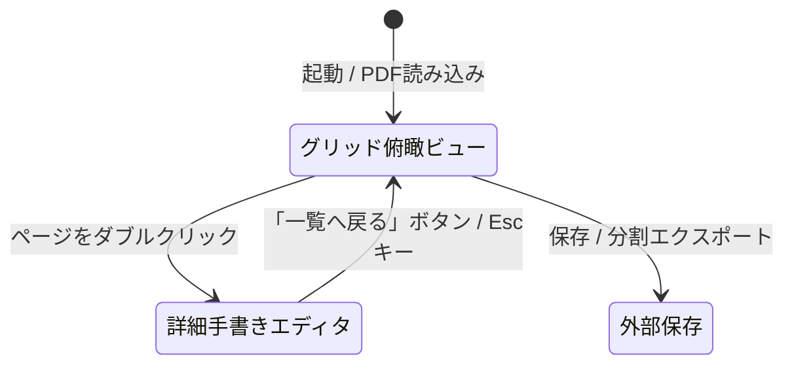

# PDF Binder 基本設計書 (Basic Design)

本書は、Windowsデスクトップ向けPDF編集・バインダー管理・手書きアノテーションアプリケーション「PDF Binder」のシステム構成、アーキテクチャ、機能仕様、画面設計、およびデータ構造を定義する正本ドキュメントです。

---

## 1. システム概要と基本方針

### 1.1 アプリケーションの目的
「PDF Binder」は、複数のPDFファイルの結合・分割・ページの並び替え・回転・白紙追加といった「バインダーとしての文書整理」と、タッチペンやマウスによる「直感的な手書きアノテーション（ペン・蛍光ペン・直線・消しゴム）」を高次元で統合したWindows向けデスクトップアプリケーションです。

### 1.2 コア設計原則
1. **ポータブル＆完全オフライン**: 外部ネットワーク接続を一切必要とせず、単一exeまたはZIP展開のみで軽快に動作すること。
2. **非破壊編集＆安全なファイル管理**: 読み込み元PDFを排他ロックせず、メモリ/一時ストレージを活用して安全な「上書き保存」「別名で保存」を実現すること。
3. **オープンソース（OSS）ライセンス適合**: 商用利用制限や強力なコピーレフト（AGPL等）のない寛容型ライセンス（MIT / Apache-2.0 / BSD）のコンポーネントのみで構成すること。
4. **高品位アノテーション**: 手書きストロークはベクター情報および高解像度透過レンダリングのハイブリッドにより、印刷・拡大時にもボケや劣化のないPDF出力を行うこと。

---

## 2. 技術スタック・ライブラリ選定

| カテゴリ | 採用技術 / ライブラリ | ライセンス | 用途・選定理由 |
| :--- | :--- | :--- | :--- |
| **プラットフォーム** | .NET 10.0 (`net10.0-windows`) | MIT | 最新の高DPI対応、高速なJIT/GC、WPFの性能改善を活用 |
| **UIフレームワーク** | WPF (Windows Presentation Foundation) | MIT | 成熟した `InkCanvas` による手書き・筆圧・消しゴム機能、強力なドラッグ＆ドロップ |
| **デザイン/スタイル** | WPF-UI または モダンFluentスタイル | MIT | Windows 11準拠の洗練された角丸・アクリル外観の実現 |
| **MVVM基盤** | CommunityToolkit.Mvvm | MIT | 軽量・高パフォーマンスな `ObservableObject`, `RelayCommand` |
| **PDF構造操作** | PdfSharp (v6.x+) | MIT | ページの回転、並び替え、削除、結合、分割、空白ページ追加、PDF保存 |
| **PDFレンダリング** | PDFium / PDFiumSharp | Apache-2.0 / BSD | Chromiumで実証済みの高速・高精細なサムネイルおよび画面描画 |
| **単体テスト** | xUnit, FluentAssertions | Apache-2.0 / MIT | ロジックの網羅的自動テスト |

---

## 3. ソリューションおよびプロジェクト構成

```text
PDFBinder/
├── .gitignore
├── GEMINI.md                     # プロジェクト開発規約・運用制約（厳守事項）
├── icon.png                      # 正本アプリアイコン
├── README.md                     # プロジェクト概要・ビルド手順
├── PDFBinder.sln                 # ソリューション定義
├── docs/
│   ├── basic_design.md           # 本書（基本設計書）
│   ├── PROJECT.md                # 機能インベントリ・進捗管理
│   └── plans/                    # 実装計画およびWalkthroughの永続アーカイブ
├── src/
│   ├── PDFBinder.Core/           # UI非依存のドメイン・PDF操作・レンダリング層
│   │   ├── Models/               # PDFドキュメント、ページ、インクストロークモデル
│   │   ├── Services/             # PdfService, RenderingService, UndoService
│   │   └── Common/               # ユーティリティ、例外定義
│   └── PDFBinder.App/            # WPF UI層（Views, ViewModels, Behaviors, Styles）
│       ├── Views/                # MainWindow, GridView, DetailEditorView
│       ├── ViewModels/           # MainViewModel, GridViewModel, DetailEditorViewModel
│       ├── Controls/             # CustomInkCanvas, ThumbnailCard
│       ├── Converters/           # 各種ValueConverter
│       └── Assets/               # アイコンリソース
└── tests/
    └── PDFBinder.Tests/          # 単体テストプロジェクト（xUnit）
```

---

## 4. データモデル設計

### 4.1 `PdfPageModel`
バインダー内の個別ページを表現するモデル。
- `PageId`: `Guid` (一意なページID)
- `SourceFilePath`: `string?` (元ファイルパス、空白ページの場合はnull)
- `OriginalPageIndex`: `int` (元ファイル内でのインデックス)
- `Rotation`: `PageRotation` (0°, 90°, 180°, 270°)
- `Width`: `double` (ポイント単位)
- `Height`: `double` (ポイント単位)
- `Thumbnail`: `BitmapSource?` (画面プレビュー用キャッシュビットマップ)
- `InkStrokes`: `StrokeCollection` (WPFインクストロークコレクション)
- `IsModified`: `bool` (編集フラグ)

### 4.2 `PdfDocumentModel`
現在作業中のバインダー全体を表現するモデル。
- `FilePath`: `string?` (現在開いているファイルのパス)
- `Pages`: `ObservableCollection<PdfPageModel>` (ページ順序リスト)
- `IsDirty`: `bool` (未保存変更の有無)
- `CanUndo` / `CanRedo`: `bool` (アンドゥ・リドゥ可能状態)

---

## 5. 主要サービスインターフェース設計

### 5.1 `IPdfService`
PDFファイルの入出力、構造操作を担当。
- `Task<PdfDocumentModel> LoadDocumentAsync(string filePath)`: ファイルロックを行わずメモリ読み込み
- `Task SaveDocumentAsync(PdfDocumentModel doc, string outputPath)`: ページ配置・回転・インク合成を行い保存
- `PdfPageModel CreateBlankPage(double width, double height)`: 指定サイズの白紙ページ生成
- `Task AppendPdfAsync(PdfDocumentModel doc, string filePath, int insertIndex)`: 別PDFのページ差し込み結合
- `Task ExportPagesAsync(IEnumerable<PdfPageModel> pages, string outputPath)`: 選択ページの分割抽出

### 5.2 `IPdfRenderer`
PDFページの画面表示用ビットマップ生成を担当。
- `Task<BitmapSource> RenderPageAsync(string filePath, int pageIndex, double dpi, PageRotation rotation)`: サムネイル/詳細画面用レンダリング
- `Task<BitmapSource> RenderBlankPageAsync(double width, double height, double dpi)`: 白紙レンダリング

### 5.3 `IUndoRedoService`
ページ操作およびインク操作の履歴管理。
- `Execute(IUndoableCommand command)`
- `Undo()`, `Redo()`
- `Clear()`

---

## 6. 画面設計とUI/UXフロー

### 6.1 画面モード構成
アプリは **「グリッド俯瞰ビュー（Binder Overview）」** を起点とし、特定ページの深掘り編集時に **「詳細手書きエディタ（Page Editor）」** へ切り替わります。



### 6.2 グリッド俯瞰ビュー（メイン画面）
- **ツールバー**:
  - ブランド表示: タイトル文字を省略し、左端に38px高品質アプリアイコンを単独配置
  - ファイル操作（リボンスタイル）: 開く (`Ctrl+O`), 上書き保存 (`Ctrl+S`), 名前を付けて保存 (`Ctrl+Shift+S`)
  - バインダー操作（リボンスタイル）: PDF追加結合, 白紙追加 (`Ctrl+B`)
  - ページ編集（アイコン専用ボタン・ツールチップ）: 左回転 (`Ctrl+L`), 右回転 (`Ctrl+R`), 削除 (`Delete`)
  - 分割エクスポート（リボンスタイル）: 選択抽出, 全分割
  - 履歴操作（アイコン専用ボタン・ツールチップ）: 元に戻す (`Ctrl+Z`), やり直す (`Ctrl+Y`)
  - 表示サイズ: 基準220px（100%）からの拡大率をリアルタイム％表示（「表示サイズ: 100%」）、クリックで100%リセット、スライダー調整
- **サムネイルグリッド**:
  - ドラッグ＆ドロップによる自由なページ順序入れ替え（ドロップインジケーター表示）
  - 複数選択（Shift+クリック、Ctrl+クリック）対応
  - 各カード上に「ページ番号」「回転ボタン」「削除ボタン」のクイックオーバーレイ
  - 外部PDFファイルのドラッグ＆ドロップによる直接差し込み結合

### 6.3 詳細手書きエディタビュー
- **上部ツールバー**:
  - 「一覧に戻る」ボタン
  - ツール選択:
    - **選択ツール**: インクストロークの選択・移動・変形
    - **ペン**: 描画色パレット、太さスライダー (1px〜20px)
    - **蛍光ペン**: 半透明描画（IsHighlighter=true）、透過ハイライト色
    - **消しゴム**: ドロップダウンで「ストローク消し（一筆ごと消去）」と「部分消し（触れた部分のみ消去）」を切替
    - **直線ツール**: ドラッグでプレビューしながらきれいな直線を引くカスタムインクモード
  - ナビゲーション: 前のページ (`←`), 次のページ (`→`), ページジャンプ
  - ズーム操作: 拡大 (`+`), 縮小 (`-`), ページ全体表示 (`Fit Page`), ページ幅フィット (`Fit Width`), 手のひらパンツール
- **キャンバスエリア**:
  - 背景にPDFiumの高解像度レンダリング結果（現在ズーム率に合わせたシャープな描画）
  - 前面にWPF `InkCanvas` をオーバーレイ配置

---

## 7. 手書きアノテーションのPDF合成・保存仕様

PDFへのインク反映は、画質とファイルサイズ、PDF標準互換性を両立するハイブリッド方式を採用します。
1. **ベクター出力（ペン・直線）**:
   - `PdfSharp` の `XGraphics.DrawLines` / `DrawPath` を用い、ストロークの座標点配列をベクターパスとして直接PDFのコンテンツストリームに書き込みます。
   - これにより、拡大・印刷時にも劣化せず、極小ファイルサイズを維持します。
2. **半透明ハイライト出力（蛍光ペン）**:
   - 蛍光ペンの透過ブレンド（Multiply / Alpha Transparency）はPDFリーダー依存の表示崩れを防ぐため、ハイライトストローク領域を高DPI透過PNGとしてレンダリングし、`XGraphics.DrawImage` でページの上に重ねて合成します。
3. **元ドキュメントの非破壊保持**:
   - 元のテキストやベクター図面は一切再エンコード・不可逆圧縮せず、新規コンテンツレイヤーとしてインクを上書き追記します。

---

## 8. 非機能要件・品質基準

1. **応答性**:
   - 100ページ以上のPDFでもUIフリーズなくスムーズにスクロールできる仮想化（`VirtualizingWrapPanel`）の採用。
   - サムネイル生成はバックグラウンドワーカースレッド（`Task.Run`）で非同期生成し、順次UIへ反映。
2. **堅牢性**:
   - 不正なPDF、破損ページ、パスワード保護PDFに対する適切なエラーハンドリングとダイアログ通知。
3. **テスト自動化**:
   - `PDFBinder.Core` 内のページ操作、マージ、スプリット、白紙挿入の単体テスト網羅率100%（全テストPASS必須）。
