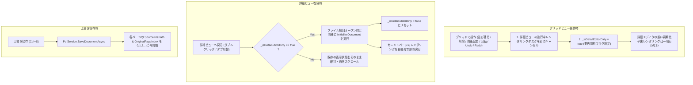

# 実装計画書: ページ操作後に詳細ビューへ戻った際にサムネイル・表示がおかしくなる不具合の修正 (Issue #177)

## 1. 概要
グリッドビューにおいてページの削除や並び替え（ドラッグ＆ドロップ）を行った後、詳細ビューへ戻った際にサムネイルやページ表示が白紙になったり、本来表示されるべきページとは異なるページが表示されたり、並び替えが反映されなかったりする不具合を根本から解消します。

---

## 2. 根本原因の分析

1. **ページ並び替え時の詳細エディタ未同期と不十分な同期ガード**:
   - `MovePage` / `MovePages` 実行時、`DetailEditor.InitializeDocument` が一切呼び出されていない。
   - `OpenPageDetail` の同期判定が `DetailEditor.Pages.Count != Document.Pages.Count` となっており、ページ数が同一の並び替えでは再同期がスキップされ、詳細エディタが古い並び順と古いページ状態のまま保持され続ける。
2. **グリッド操作中の詳細エディタによる無駄な裏レンダリングと排他ロック競合**:
   - グリッドで削除等を行った際、非表示の詳細エディタが同期的に `InitializeDocument` を呼ばれ、最大10ページの重い裏レンダリングを開始して PDFium の排他ロック（`PriorityAsyncLock`）を奪い合う。
   - 詳細ビュー復帰時に高解像度レンダリングが待たされ、仮プレビュー用サムネイルも `null` の場合は画面が白紙に見える。
3. **上書き保存後の元ページインデックス未更新（保存を挟むケース）**:
   - `PdfService.SaveDocumentAsync` でファイルを上書きした際、ファイル自体は新しいページ構成に置き換わるが、メモリ上の `PdfPageModel.OriginalPageIndex` が `0, 1, 2, ...` に再インデックスされない。
   - 新しいファイルの総ページ数を超えたインデックスは PDFium の安全策により白紙（`CreateBlankPageBitmap`）が返され、超えないインデックスは番号ずれにより別のページが表示される。
4. **連続表示モードでのスクロール位置破綻とWPFコンテナ未生成**:
   - 詳細ビューへ戻った際、WPF の `ItemsControl`（非表示から表示への切替直後）は視覚要素コンテナ（`ItemContainerGenerator`）をまだ生成完了しておらず、目的ページへのスクロール補正に失敗する。

---

## 3. 基本設計方針（遅延再構築方式 / Lazy Re-initialization）

ユーザーからの指示・合意に基づき、以下のライフサイクルを導入します：

### 本変更による影響と「これだけで修正されない現象」への対応
- **メリット**:
  - グリッドビューでの高速な連続ドラッグ＆ドロップや削除操作中に、裏で詳細エディタが無駄なCPU/メモリ・排他ロックを消費しない。
  - 並び替え・削除・追加・Undo/Redo のすべてにおいて、詳細ビューとの順序や表示の完全な一致が保証される。
- **これだけで修正されない現象への不可欠な対策**:
  - **上書き保存時のインデックスずれ**: 詳細ビューを再構築しても、元ファイルと `OriginalPageIndex` がずれていれば白紙化するため、**タスク1（保存時の再インデックス）は必須**。
  - **グリッド側サムネイルタスクの制御**: ページ削除時にグリッド側のサムネイルタスクを安全に中断・補完再開する。
  - **連続表示スクロール位置補正**: 詳細復帰時にWPFのコンテナ生成（`Loaded`）を待機して正確にスクロール位置を合わせる。

---

## 4. 実装タスクと変更詳細

### タスク 1: 上書き保存後のページインデックス（`OriginalPageIndex`）再構築
- **対象ファイル**: `src/PDFBinder.Core/Services/PdfService.cs`
- **変更内容**:
  - `SaveDocumentAsync` において、ファイルの書き出し・置換（`SafeReplaceFile`）が成功した直後、`doc.Pages` 内の全ページについて以下を同期更新する：
    - `page.SourceFilePath = outputPath;`
    - `page.OriginalPageIndex = i;`
    - `page.OriginalRotation = page.Rotation;`
    - `page.IsModified = false;`

### タスク 2: 詳細エディタのレンダリングキャンセル＆遅延再構築機構（`_isDetailEditorDirty`）の導入
- **対象ファイル**:
  - `src/PDFBinder.App/ViewModels/DetailEditorViewModel.cs`
  - `src/PDFBinder.App/ViewModels/MainViewModel.cs`
- **変更内容**:
  - `DetailEditorViewModel`:
    - 外部から進行中レンダリングタスクを即時中断できる `CancelDynamicRender()` メソッドを追加。
    - ページコレクションを即時破棄する `ClearDocument()` メソッドを追加。
  - `MainViewModel`:
    - `_isDetailEditorDirty` フラグを導入。
    - グリッドビュー表示中における構造変更操作（`MovePage`, `MovePages`, `DeleteSelectedPages`, `AddBlankPage`, `AppendDocument`, `InsertPagesFromExternalFilesAsync`, `RotateClockwise`, `RotateCounterClockwise`, `Undo`, `Redo`）において、`MarkDetailEditorDirty()` を呼び出す：
      - 詳細エディタのレンダリングタスクを即時キャンセル（`DetailEditor?.CancelDynamicRender()`）。
      - `_isDetailEditorDirty = true;` をセット。
      - グリッド操作中の `DetailEditor?.InitializeDocument(Document)` 呼び出しを抑止。
    - 詳細ビューへ復帰した際（`OnIsDetailViewActiveChanged(true)` および `OpenPageDetail(page)`）：
      - `_isDetailEditorDirty` が `true` の場合、現在の `Document` と対象 `page` を渡して `DetailEditor.InitializeDocument(Document, page)` を実行し、ファイル初回オープン時と同様にカレントページの即時レンダリングを開始。
      - `_isDetailEditorDirty = false;` にリセット。
      - `OpenPageDetail` 内の `Pages.Count != Document.Pages.Count` という不完全なガードを撤廃。

### タスク 3: ページ削除時のグリッドサムネイルタスク制御と補完
- **対象ファイル**: `src/PDFBinder.App/ViewModels/MainViewModel.cs`
- **変更内容**:
  - `DeleteSelectedPages` において、削除前に進行中のグリッドサムネイル生成タスク（`_thumbnailCts`）を安全にキャンセル・待機。
  - 削除完了後、残存ページのうち `Thumbnail == null` または `IsThumbnailDirty` なページがあれば `EnsureThumbnailsGeneratedAsync()` をトリガーしてサムネイルを確実に補完。

### タスク 4: 詳細ビュー復帰時のスクロール位置補正（WPFコンテナ生成待機）
- **対象ファイル**: `src/PDFBinder.App/Views/DetailEditorView.xaml.cs`
- **変更内容**:
  - `OnScrollToPageRequested` において、連続表示時に `ContainerFromItem(itemVm)` が `null` の場合は、`Dispatcher.InvokeAsync` にてコンテナ生成（`DispatcherPriority.Loaded`）を待機してから再試行するフォールバック処理を追加。

---

## 5. 単体テスト計画

- **テストプロジェクト**: `tests/PDFBinder.Tests`
- **追加・更新するテストケース**:
  1. `PdfServiceTests.cs`:
     - ページ削除後に `SaveDocumentAsync` を実行した際、残存ページの `OriginalPageIndex` が `0, 1, 2, ...` に正しく再インデックスされ、`PdfiumRenderer` で正常にレンダリングできることを検証。
  2. `MainViewModelTests.cs`:
     - グリッドビューで `MovePage` / `MovePages` を実行した際、`_isDetailEditorDirty` がセットされ、詳細ビューへ戻った際に正しく並び替えが反映された状態で `DetailEditor.Pages` が再構築されることを検証。
     - グリッドビューで `DeleteSelectedPages` を実行した際、詳細エディタのレンダリングがキャンセルされ、詳細ビュー復帰時に指定ページから正常に再構築・レンダリングされることを検証。

---

## 6. 完了条件
1. `dotnet test` が全件 100% PASS すること。
2. `dotnet build` が警告・エラーなく成功すること。
3. グリッドビューでページ並び替え・削除を行った後（保存有無問わず）、詳細ビューに切り替えても並び順が完全に反映され、白紙やページずれが発生しないこと。
