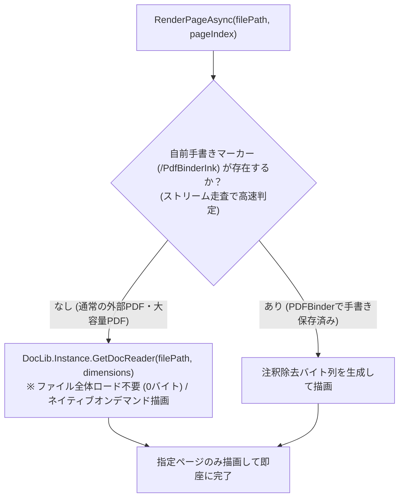

# 実装計画: Issue #208 大容量PDF読み込み時のメモリ破損・強制終了の解消 (Plan-2)

## 1. 概要
- **対象Issue**: #208「ファイルを開いたとき、切り替えたときに強制終了してしまう」
- **対象バージョン**: `0.11.3`
- **作業ブランチ**: `fix/issue-208-crash-on-switch-file`
- **目的**: 158MB、400ページ超の大容量PDFを開いた際に、ページ描画ごとの全バイト列メモリ展開と非管理メモリ多重複製（`Marshal.AllocHGlobal`）に起因するネイティブポインタ破損・強制終了（`AccessViolationException`）を根本から解消する。

---

## 2. 根本原因の分析
1. **ページごとのファイル全バイト列展開と非管理メモリ複製**:
   - `PdfiumRenderer.RenderPageAsync` は、自前手書き注釈除去のため `GetRenderBytes` でファイル全体を `byte[]`（158MB）に読み込み、`DocLib.Instance.GetDocReader(renderBytes, dimensions)` を呼び出していた。
   - Docnet.Core の `byte[]` 版は内部で `Marshal.AllocHGlobal(158MB)` で非管理メモリを確保し `Marshal.Copy` で複製している。
   - サムネイル先行生成（50ページ）や詳細表示により、「158MBの確保・コピー・破棄」が短時間で数十回（数GB〜数十GB）繰り返され、ヒープ断片化と激しいGCにより PDFium の内部ポインタが破損、`DocReader.Dispose()` の `FPDFDOC_ExitFormFillEnvironment` でアクセス違反（`0xc0000005`）が発生していた。
2. **通常外部PDFに対する不要な全ページ走査**:
   - 外部から開いた通常のPDFには自前手書き注釈（`/PdfBinderInk`）が一切存在しないにもかかわらず、毎回 158MB を `PdfSharp` で 400 ページ全走査していた。

---

## 3. 解決アプローチ

1. **自前手書きマーカーの高速ストリーム判定**:
   - `PdfBinderInkAnnotation` が保存時に付与する ASCII マーカー `/PdfBinderInk` の有無を、ファイル全体をメモリにロードせず、小さな固定長バッファ（4KB〜64KB）によるファイルストリーム走査で判定する。
   - 外部PDFにはマーカーが存在しないため、瞬時に `false` と判定される。判定結果はファイルの更新日時とともにキャッシュする。
2. **ファイルパス直接によるオンデマンドレンダリング**:
   - マーカーが存在しないファイルでは、`DocLib.Instance.GetDocReader(string filePath, dimensions)` を直接使用する。
   - `File.ReadAllBytes`（158MB）、`Marshal.AllocHGlobal`（158MB）、`Marshal.Copy` は完全にスキップされ、メモリ割り当ては 0 バイトとなる。
   - PDFium（`FPDF_LoadDocument`）が OS ファイルマッピング経由で対象ページ（数KB〜数MB）のみをオンデマンド描画するため、メモリ消費が極小化されクラッシュが完全に解消する。
3. **テキスト・リンク抽出の最適化**:
   - `ExtractCharacters`: マーカーなしの場合は直接 `GetDocReader(filePath, dimensions)` を使用。
   - `ExtractLinks`: マーカーなしの場合は `PdfSharp.Pdf.IO.PdfReader.Open(filePath, PdfDocumentOpenMode.Import)` を直接使用し、メモリ展開を排除。

---

## 4. 変更対象ファイルと責務

| ファイル | 変更内容 |
| :--- | :--- |
| `src/PDFBinder.Core/Services/PdfiumRenderer.cs` | マーカー高速判定メソッド追加、マーカーなし時のファイルパス直接 `GetDocReader` 呼び出し、`ExtractCharacters`/`ExtractLinks` のパス直接対応 |
| `tests/PDFBinder.Tests/PdfiumRendererTests.cs` | マーカーなしPDFのファイルパス直接描画テスト、マーカーありPDFの正常描画テスト、大容量を想定した連続描画の安定性テスト |

---

## 5. 検証手順
1. `dotnet build`: 警告・エラーなしでビルド成功を確認。
2. `dotnet test`: 既存テストおよび新規追加テストを含め 100% PASS を確認。
3. 検証報告書（Walkthrough-2）の作成と永続保存。
