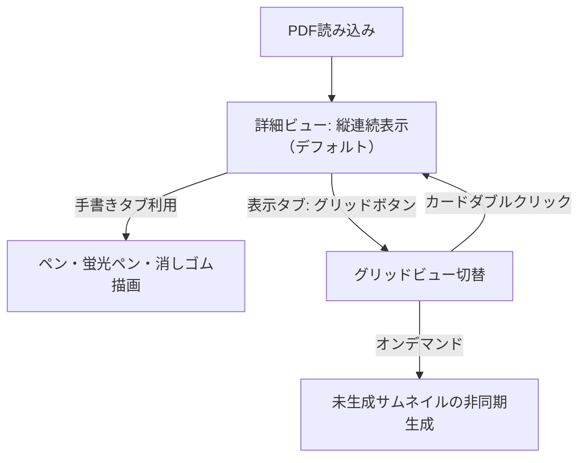

# [Issue #23] 詳細ビューを基本とするUIリニューアルおよび表示タブ新設 実装計画

## 概要
Issue #23 に基づき、PDF Binder の基本表示を「縦に並べた連続詳細ビュー」へ移行し、グリッド俯瞰ビューは必要な時のみ切り替えて使用する構成へと刷新します。
あわせて、リボンに新しく「表示」タブを新設してズーム操作およびビュー切り替え（詳細／グリッド）を一本化し、手書きタブの不要なページ遷移ボタン等の整理、およびグリッド表示時のみのオンデマンドサムネイル生成を実現します。

---

## ユーザー合意事項（/grill-me インタビュー結果）
1. **詳細ビューの構成**: 全ページを縦一列に並べるリスト（ItemsControl）とし、各ページごとに背景画像と `EditorInkCanvas` を配置。手書き設定（ペン・色・太さ等）は全ページに共通適用され、ページ単位でストロークを保持。
2. **拡大縮小ボタンの一本化**: 「PDF編集タブ」および「手書きタブ」から拡大縮小ボタンを廃止し、新設する「表示タブ」に一本化。
3. **ビュー切り替えUI**: 表示タブにリボンスタイルの相互排他ボタン（RadioButton）として「詳細」「グリッド」を配置し、現在のアクティブビューを強調表示。
4. **サムネイル生成タイミング**: PDF読み込み時はサムネイル生成を行わず、グリッドボタン押下時に初めてオンデマンド非同期生成（プレースホルダー表示・非ブロッキング）。
5. **グリッド時のズームリセット表示**: 標準サムネイルサイズ（220px）を100%とした比率（%）を表示し、クリックで標準サイズへリセット。
6. **グリッドでのダブルクリック**: 詳細ビューへ切り替え、ダブルクリックされた該当ページへスムーズにスクロール。
7. **手書きタブ無効化時のタブ遷移**: 手書きタブを開いている状態でグリッドビューに切り替えた場合は、「表示タブ」へ自動切り替え。
8. **ページ番号表示**: 詳細ビューではページ枠外の装飾を省き、ステータスバーに現在表示・操作中のページ番号（例:「ページ 3 / 10」）を表示。
9. **詳細ビューでの編集操作**: クリック／操作中のページ（または中央に表示中のページ）を対象として回転・削除・白紙追加などのPDF編集を実行。

---

## 設計詳細

### 1. タブ構造とUIレイアウト
- **最上段タブバー**:
  - `[PDF編集]` (Index 0): 既存のファイル操作、白紙追加、抽出、分割、回転、削除、元に戻す/やり直す（ズームボタンは削除）
  - `[手書き]` (Index 1): 選択、ペン、蛍光ペン、消しゴム、手のひら、直線、太さ、色パレット（一覧に戻る、ズーム、前/次ページボタンは削除、グリッドビュー時は非活性）
  - `[表示]` (Index 2, 新設):
    - **ビュー切り替えグループ**: 「詳細」ラジオボタン、「グリッド」ラジオボタン
    - **ズーム操作グループ**: 「縮小 (Ctrl+-)」、「倍率表示 / リセット (Ctrl+0)」、「拡大 (Ctrl++)」

### 2. ズーム管理と一本化
- `MainViewModel` に一本化されたズームコマンド（`ZoomInCommand`, `ZoomOutCommand`, `ZoomResetCommand`）および `CurrentZoomDisplay`（表示文字列）を導入。
- 詳細ビュー時は `DetailEditor.Zoom`（50%〜300%）を操作・表示。
- グリッドビュー時は `ThumbnailSize`（140px〜360px、基準220px）を操作し、`ThumbnailSize / 220.0` をパーセンテージ表示。
- キーバインド（Ctrl++, Ctrl+-, Ctrl+0）を統一コマンドにバインド。

### 3. 詳細ビュー（縦連続表示）の構造
- `DetailEditorView.xaml` を単一ページ表示から、全ページを縦に並べる `ScrollViewer` ＋ `ItemsControl` 構造へ更新。
- 各アイテムにドロップシャドウ付きの用紙ボーダー、背景画像（PDFレンダリング画像）、前面の `EditorInkCanvas` を配置。
- ページがアクティブ（クリックまたはスクロール）になった際に対象ページとして認識し、ステータスバーを「ページ X / Y」に更新。
- 全ページのスケールは外側のコンテナまたは各用紙の `LayoutTransform`（`ScaleTransform`）により連動ズーム。

### 4. オンデマンド・サムネイル生成
- `OpenDocumentAsync` および `AppendDocumentAsync` での `_ = GenerateThumbnailsAsync()` 自動呼び出しを削除。
- グリッドビューへの切り替え時（`SwitchToGridViewCommand` または `IsDetailViewActive = false` への遷移時）に、未生成ページを検出して `GenerateThumbnailsAsync()` を実行。

---

## 変更対象ファイル一覧

### [MODIFY]
1. `src/PDFBinder.App/MainWindow.xaml`
   - リボンタブに「表示」タブを追加（Index 2）
   - 「PDF編集」タブおよび「手書き」タブから拡大縮小・ページ遷移・一覧に戻るボタンを削除
   - 「表示」タブにビュー切り替え（詳細／グリッド）と拡大縮小コントロールを配置
   - キーバインドを統一ズームコマンドへ変更
2. `src/PDFBinder.App/ViewModels/MainViewModel.cs`
   - 「表示」タブ対応（タブインデックス管理）
   - グリッド／詳細の統一ズームプロパティ・コマンドの実装
   - オンデマンド・サムネイル生成トリガーの実装
   - グリッドビュー切替時の手書きタブ自動遷移処理
   - ダブルクリック時の指定ページへのスクロール要求通知
3. `src/PDFBinder.App/ViewModels/DetailEditorViewModel.cs`
   - 複数ページ（全ページ）管理に対応した ViewModel 設計（または各ページ用サブViewModel連携）
   - 不要となった前ページ・次ページコマンドの整理
4. `src/PDFBinder.App/Views/DetailEditorView.xaml`
   - 縦連続表示（全ページ並び）レイアウトへの変更
   - 外部からの特定ページへのスクロール連携
5. `src/PDFBinder.App/Views/DetailEditorView.xaml.cs`
   - スムーズスクロールやアクティブページ検知処理の追加
6. `src/PDFBinder.App/Views/GridView.xaml.cs`
   - ダブルクリック時に該当ページを渡して詳細ビューへ切り替え

### [TEST]
7. `tests/PDFBinder.Tests/ViewModels/MainViewModelTests.cs` (および新規テストファイル)
   - 詳細ビューがデフォルトであることのテスト
   - 表示タブにおけるズームコマンドのテスト（詳細ビュー時／グリッドビュー時）
   - ビュー切り替え時のサムネイル生成動作テスト
   - グリッド切替時の手書きタブ無効化およびタブ自動切り替えテスト

---

## 検証手順
1. `dotnet test` で既存テストおよび新規追加テストがすべてパスすることを確認。
2. `dotnet build` で警告およびエラーがないことを確認。
3. アプリ起動確認:
   - PDFを開いた際、詳細ビュー（縦連続スクロール）がデフォルトで表示されること。
   - 表示タブから「グリッド」を選択するとグリッドビューに切り替わり、サムネイルが生成されること。
   - グリッドビューからカードをダブルクリックすると、詳細ビューの当該ページへ移動すること。
   - 表示タブの拡大縮小ボタンが、詳細ビューではページ倍率、グリッドビューではサムネイルサイズに連動すること。
   - グリッドビュー時に手書きタブが無効化され、詳細ビュー時に有効化されること。
