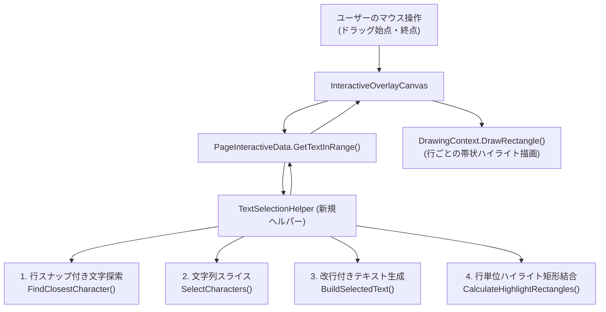

# 実装計画: 文字選択の行単位（ストリーム順）選択への改善 (Issue #98)

## 1. 概要
PDFビューア（詳細手書きエディタ）におけるテキスト選択機能を、従来の2次元矩形領域（ボックス判定）から、横書き文章の流れに沿った**「行単位・ストリーム順の範囲選択（ハイブリッド方式）」**へと改善します。
ドラッグ開始位置から終了位置までの文章が途切れることなく自然に選択され、改行が行の切り替わりで適切に挿入され、ハイライト描画も行ごとの美しい一体矩形（帯状）で描画されるようにします。

---

## 2. 課題と目的

### 現状の課題
- マウスドラッグで作成される `Rect`（四角形）と交差する文字のみを抽出しているため、複数行にまたがって斜めにドラッグすると、2行目以降の左右の文字が削られてしまい、矩形選択（カラム選択）のような不自然な選択状態になる。
- 抽出された文字を単純連結しているため、複数行にまたがる選択時に改行コードが含まれず、1行に繋がってしまう。
- 描画が1文字ずつの個別バウンディングボックスの描画となっており、文字間の隙間や枠線が目立つ。

### 達成目標
1. **ストリーム順（行単位）の範囲選択**:
   - 1行目のドラッグ開始文字から、中間行の全文字、最終行のドラッグ終了文字までが横書きの文章として連続して選択される。
   - 逆方向（下から上、右から左）のドラッグにも自然に対応する。
2. **余白スナップ**:
   - 行の右側余白へマウスを動かした場合は「行末」、左側余白へ動かした場合は「行頭」へ適切にスナップする。
3. **正確なテキストコピーと改行の自動挿入**:
   - 句読点（「、」「。」「,」等）やスペース文字の欠落を完全に防止する。
   - 行が切り替わる境界を検出し、自然な改行コード（`\r\n`）を自動挿入してクリップボードへコピー可能とする。
4. **行単位ハイライトの一体描画**:
   - 同一行の選択文字の矩形を結合（マージ）し、1行につき1つの滑らかなハイライト矩形として描画する。

---

## 3. アーキテクチャと設計方針

単一責任の原則（SRP）および30〜50行制限を遵守し、選択アルゴリズムを独立したヘルパークラスとして疎結合に実装します。

---

## 4. 変更対象コンポーネントと作業詳細

### ① 新規サービス/ヘルパーの追加
- **ファイル**: `src/PDFBinder.Core/Services/TextSelectionHelper.cs`
- **責務**:
  - `FindClosestCharacter(IReadOnlyList<PdfTextCharacter> characters, Point point)`:
    - Y座標に基づき対象行を特定（行間や上下余白でも垂直距離で最近傍行を特定）。
    - 行内でX座標に基づき文字を特定（行頭より左なら先頭文字、行末より右なら最終文字にスナップ）。
  - `SelectCharacters(IReadOnlyList<PdfTextCharacter> characters, Point startPoint, Point endPoint)`:
    - 開始・終了点から最近傍文字を特定し、インデックス順にスライス抽出。
  - `BuildSelectedText(IReadOnlyList<PdfTextCharacter> selectedCharacters)`:
    - 抽出文字を連結。文字間の垂直座標の変動を検知し、行の変わり目に改行コード（`\r\n`）を挿入。
  - `CalculateHighlightRectangles(IReadOnlyList<PdfTextCharacter> selectedCharacters)`:
    - 同一行にある連続文字群の `BoundingBox` を `Rect.Union` して行ごとの矩形リストを生成。
  - `IsDifferentLine(PdfTextCharacter current, PdfTextCharacter next)`:
    - 垂直方向の重なり量（Overlap）および中心Y座標の差から行の切り替わりを判定。

### ② モデルの拡張
- **ファイル**: `src/PDFBinder.Core/Models/PageInteractiveData.cs`
- **変更内容**:
  - `GetTextInRange(Point startPoint, Point endPoint)` メソッドを追加。
    - 戻り値: `TextSelectionResult(string SelectedText, IReadOnlyList<PdfTextCharacter> SelectedCharacters, IReadOnlyList<Rect> HighlightRects)`
  - 既存の `GetTextInRect(Rect selectionRect)` は互換性のため維持。

### ③ コントロール（UI）の描画・操作更新
- **ファイル**: `src/PDFBinder.App/Controls/InteractiveOverlayCanvas.cs`
- **変更内容**:
  - フィールドに `_highlightRects`（`IReadOnlyList<Rect>`）を追加。
  - `HandleTextDragSelection(Point currentPos)`:
    - `GetTextInRange(_dragStartPoint.Value, currentPos)` を呼び出し、選択文字、選択テキスト、およびハイライト矩形リストを更新。
  - `RenderSelectionHighlights(DrawingContext dc)`:
    - 従来の個別文字ループ描画から、`_highlightRects` をループして行単位の一体矩形を描画するように変更。
  - `ClearSelection()`:
    - `_highlightRects` のクリア処理を追加。

### ④ 単体テストの追加と拡充
- **ファイル**: `tests/PDFBinder.Tests/Services/TextSelectionHelperTests.cs`（新規作成）
  - 同一行内での正方向（左→右）・逆方向（右→左）の選択テスト。
  - 複数行にまたがる選択時の文字順序および改行コード（`\r\n`）挿入テスト。
  - 句読点（「、」「。」「,」等）が欠落せず保持されることの検証。
  - 行の左右余白へのドラッグ時に行頭・行末へ正しくスナップすることの検証。
  - 行単位のハイライト矩形が同一行内で1つの矩形に正しくマージされることの検証。
  - 文字が空（0文字）の場合の安全な動作テスト。
- **ファイル**: `tests/PDFBinder.Tests/Models/PageInteractiveDataTests.cs`
  - `GetTextInRange` メソッドの連携テストを追加。

---

## 5. 検証手順

1. **自動テストの実行**:
   - `dotnet test` を実行し、既存の全503件のテストおよび新規追加テストがすべて100%パスすることを確認。
2. **ビルド検証**:
   - `dotnet build` を実行し、警告やエラーがないことを確認。
3. **UI・動作確認**:
   - アプリを起動し、複数行のテキストを含むPDFを開いてテキスト選択ツールを使用。
   - 複数行にまたがって斜めにドラッグした際、1行目の開始文字〜最終行の終了文字までが自然な文章として選択されることを確認。
   - 余白へドラッグした際に行末・行頭まで綺麗に吸着することを確認。
   - 選択されたハイライトが、文字ごとの細切れではなく行ごとの綺麗な帯状矩形として描画されることを確認。
   - コピー（Ctrl+C または右クリックメニュー）してメモ帳等に貼り付けた際、句読点が欠落せず、行の変わり目に改行が入っていることを確認。

---

## 6. リスク評価と対策
- **リスク**: 2段組みや複雑な表レイアウトなど特殊なPDFで、文字インデックス順と視覚順序が異なる場合。
  - **対策**: 基本はPDFiumが保持するインデックス順を採用しつつ、行判定ヘルパーで明らかな行間差を検知し、頑健なスナップ判定を行う。
- **リスク**: 描画パフォーマンスの低下。
  - **対策**: 文字ごとの個別描画から行単位の統合矩形描画へ切り替えるため、描画オブジェクト数が大幅に削減され、むしろレンダリングパフォーマンスは向上する。
